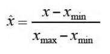
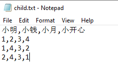
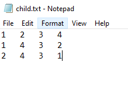
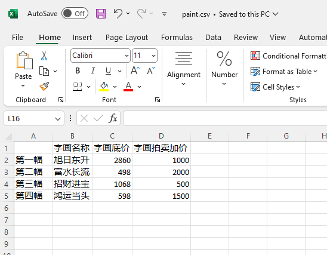

# 数据分析 - Pandas

# Pandas数据结构的介绍

1. Pandas是基于NumPy构建的，让以NumPy为中心的应用变得更加简单。
2. Pandas是使数据分析工作变得更快、更简单的高级数据结构和操作工具。
3. 提供数据**按轴自动对齐**或数据对齐显示功能，可以防止许多由于数据未对齐以及数据源不同（索引方式不同）而导致的常见错误。
4. 处理缺失数据

> 两个主要数据结构：**Series**和**DataFrame**。

## Series数据结构

Series是一种类似于**一维数组**的对象，由**一组数据**以及一组与之相关的**数据标签**（索引）组成。

Series由两部分构成：索引放在左边，值放在右边。

如果没有为数据指定索引，Series也会自动创建一个0到N-1的整数型索引。

- Pandas最简单的Series
```python
from pandas import Series
obj = Series(["287xxxx42","391xxxx91","281xxxx12","371xxxx31","261xxxx42"])
print(obj)

# Output:
# 0    287xxxx42
# 1    391xxxx91
# 2    281xxxx12
# 3    371xxxx31
# 4    261xxxx42
# dtype: object
```

- Pandas的Series的索引和值
```python
from pandas import Series
obj = Series(["287xxxx42","391xxxx91","281xxxx12","371xxxx31","261xxxx42"])
obj_index = obj.index
obj_values = obj.values
print(obj_index)
print(obj_values)

# Output:
# RangeIndex(start=0, stop=5, step=1)
# ['287xxxx42' '391xxxx91' '281xxxx12' '371xxxx31' '261xxxx42']

# Explaination:
# obj.index内存储的就是Series中的索引
# obj.values内存储的就是Series的值。
```

- Pandas的Series的索引和值的输出
```python
from pandas import Series
obj = Series(["287xxxx42","391xxxx91","281xxxx12","371xxxx31","261xxxx42"], index =["qq_name1","qq_name2","qq_name3","qq_name4","qq_name5"])
print(obj)

# Output:
# qq_name1    287xxxx42
# qq_name2    391xxxx91
# qq_name3    281xxxx12
# qq_name4    371xxxx31
# qq_name5    261xxxx42
# dtype: object
```

- Pandas中根据Series的索引输出值
```python
from pandas import Series
obj = Series(["287xxxx42","391xxxx91","281xxxx12","371xxxx31","261xxxx42"], index =["qq_name1","qq_name2","qq_name3","qq_name4","qq_name5"])
print(obj)

# Output:
# qq_name1    287xxxx42
# qq_name2    391xxxx91
# qq_name3    281xxxx12
# qq_name4    371xxxx31
# qq_name5    261xxxx42
# dtype: object
```

```python
from pandas import Series
obj=Series(["287xxxx42","391xxxx91","281xxxx12","371xxxx31","261xxxx42"], index=["qq_name1","qq_name2","qq_name3","qq_name4","qq_name5"])
print(obj["qq_name1"])

# Output:
# 287xxxx42

# Explanation:
# 通过obj["qq_name1"]的引用方式来访问Series中"qq_name1"对应的值。
```

- Pandas中根据字典创建Series
```python
from pandas import Series
dicts = {"qq_name1":287xxxx42,"qq_name2":391xxxx91,"qq_name3":281xxxx12,"qq_name4":371xxxx31,"qq_name5":261xxxx42}
obj = Series(dicts)
print(obj)

# Output:
# qq_name1    287xxxx42
# qq_name2    391xxxx91
# qq_name3    281xxxx12
# qq_name4    371xxxx31
# qq_name5    261xxxx42
# dtype: object
```

## Series数据类型的运算

Series这种数据类型的最重要的一个功能是在进行算术运算时会**自动对齐**不同索引的数据。

- Pandas中根据Series数据类型的相加运算
```python
from pandas import Series
goods_in = Series({"苹果":30,"梨":25,"香蕉":20,"桃":21,"李子":15})
goods_other_in = Series({"苹果":10,"梨":20,"香蕉":15,"桃":10,"西瓜":50})
goods_kucun = goods_in + goods_other_in
print(goods_kucun)

# Output:
# 李子     NaN
# 桃     31.0
# 梨     45.0
# 苹果    40.0
# 西瓜     NaN
# 香蕉    35.0
# dtype: float64
```

> 如果两个Series相加，索引在两个Series中存在的话，就实现索引对应值的计算；如果其中一个Series中有的索引，另一个Series中没有，相加的结果中就会出现**NaN**（表示空值）这样的值。

- Pandas中根据Series索引赋值修改内容
```python
from pandas import Series
import numpy as np
goods = Series([30,25,20,21,np.nan],index=["苹果","梨","香蕉","桃","李子"])
goods["李子"] = 15
print(goods)

# Output:
# 苹果    30.0
# 梨     25.0
# 香蕉    20.0
# 桃     21.0
# 李子    15.0
# dtype: float64
```

## DataFrame数据结构

DataFrame是一个**表格型**的数据结构，它含有一组有序的列，每列可以是不同的值类型（数值、字符串、布尔型等）。

DataFrame既有**行索引**也有**列索引**，它可以被看作由Series组成的字典，只不过共用了索引。

- Pandas模块构建DataFrame
```python
from pandas import DataFrame
paints = {"字画名称":["旭日东升","富水长流","招财进宝","鸿运当头"],"字画底价":[2860,498,1068,598],"字画拍卖加价":[1000,2000,500,1500]}
goods_in = DataFrame(paints)
print(goods_in)

# Output:
#    字画名称  字画底价  字画拍卖加价
# 0  旭日东升  2860    1000
# 1  富水长流   498    2000
# 2  招财进宝  1068     500
# 3  鸿运当头   598    1500
```

- 利用Pandas模块的DataFrame指定列顺序
```python
from pandas import DataFrame
paints = {"字画名称":["旭日东升","富水长流","招财进宝","鸿运当头"],"字画底价":[2860,498,1068,598],"字画拍卖加价":[1000,2000,500,1500]}
goods_in = DataFrame(paints, columns = ["字画名称","字画拍卖加价","字画底价"])
print(goods_in)

# Output:
#    字画名称  字画拍卖加价  字画底价
# 0  旭日东升    1000  2860
# 1  富水长流    2000   498
# 2  招财进宝     500  1068
# 3  鸿运当头    1500   598
```

DataFrame最终是按照columns指定的顺序排列的。如果传入的列名在数据中是无法找到的，就会产生NaN值。

- 利用Pandas模块的DataFrame指定列空缺
```python
from pandas import DataFrame
paints = {"字画名称":["旭日东升","富水长流","招财进宝","鸿运当头"],"字画底价":[2860,498,1068,598],"字画拍卖加价":[1000,2000,500,1500]}
goods_in = DataFrame(paints, columns = ["字画名称","字画拍卖加价","字画底价","字画所属人"])
print(goods_in)

# Output:
#    字画名称  字画拍卖加价  字画底价 字画所属人
# 0  旭日东升    1000  2860   NaN
# 1  富水长流    2000   498   NaN
# 2  招财进宝     500  1068   NaN
# 3  鸿运当头    1500   598   NaN
```

- 利用Pandas模块的DataFrame通过字典标记的方式获取Series结构列数据
```python
from pandas import DataFrame
paints = {"字画名称":["旭日东升","富水长流","招财进宝","鸿运当头"],"字画底价":[2860,498,1068,598],"字画拍卖加价":[1000,2000,500,1500]}
goods_in = DataFrame(paints, index = ["第一幅","第二幅","第三幅","第四幅"])
paints_price = goods_in["字画底价"]
print(paints_price)

# Output:
# 第一幅    2860
# 第二幅     498
# 第三幅    1068
# 第四幅     598
# Name: 字画底价, dtype: int64

# Explanation:
# 代码中定义了字画的DataFrame之后，直接通过goods_in["字画底价"]来访问“字画底价”这个维度的数据，获取的是一个Series结构的数据。
```

- 利用Pandas模块的DataFrame通过位置获取Series结构行数据
```python
from pandas import DataFrame
paints = {"字画名称":["旭日东升","富水长流","招财进宝","鸿运当头"],"字画底价":[2860,498,1068,598],"字画拍卖加价":[1000,2000,500,1500]}
goods_in = DataFrame(paints, index = ["第一幅","第二幅","第三幅","第四幅"])
paints_three = goods_in.loc["第三幅"]
print(paints_three)

# Output:
# 字画名称      招财进宝
# 字画底价      1068
# 字画拍卖加价     500
# ame: 第三幅, dtype: object
```

> loc就是位置的关键词

-利用Pandas模块的DataFrame通过位置结合切片获取数据
```python
from pandas import DataFrame
paints = {"字画名称":["旭日东升","富水长流","招财进宝","鸿运当头"],"字画底价":[2860,498,1068,598],"字画拍卖加价":[1000,2000,500,1500]}
goods_in = DataFrame(paints, index=["第一幅","第二幅","第三幅","第四幅"])
paints_three = goods_in.loc["第三幅":"第四幅","字画名称":"字画底价"]
print(paints_three)
print("---------------------------------------------------")
paints_four = goods_in.loc[["第三幅","第四幅"],["字画名称","字画底价"]]
print(paints_four)

# Output:
#      字画名称  字画底价
# 第三幅  招财进宝  1068
# 第四幅  鸿运当头   598
# ---------------------------------------------------
#      字画名称  字画底价
# 第三幅  招财进宝  1068
# 第四幅  鸿运当头   598
```

- 利用Pandas模块的DataFrame通过位置结合布尔型数组获取数据
```python
from pandas import DataFrame
paints = {"字画名称":["旭日东升","富水长流","招财进宝","鸿运当头"],"字画底价":[2860,498,1068,598],"字画拍卖加价":[1000,2000,500,1500]}
goods_in = DataFrame(paints, index=["第一幅","第二幅","第三幅","第四幅"])
paints_three = goods_in.loc[goods_in["字画底价"]>500,:]
print(paints_three)
print("------------------------------------------")
paints_four = goods_in.loc[(goods_in["字画底价"]>500)&(goods_in["字画拍卖加价"]>1000),:]
print(paints_four)

# Output:
#      字画名称  字画底价  字画拍卖加价
# 第一幅  旭日东升  2860    1000
# 第三幅  招财进宝  1068     500
# 第四幅  鸿运当头   598    1500
# ------------------------------------------
#      字画名称  字画底价  字画拍卖加价
# 第四幅  鸿运当头   598    1500
```

## DataFrame数据的修改

DataFrame数据结构内的列可以通过赋值的方式进行修改。

- 利用Pandas模块的DataFrame修改列数据为相同值
```python
from pandas import DataFrame
paints = {"字画名称":["旭日东升","富水长流","招财进宝","鸿运当头"],"字画底价":[2860,498,1068,598],"字画拍卖加价":[1000,2000,500,1500]}
goods_in = DataFrame(paints, columns=["字画名称","字画拍卖加价","字画底价","字画所属人"])
goods_in["字画所属人"] = "张三"
print(goods_in)

# Output:
#    字画名称  字画拍卖加价  字画底价 字画所属人
# 0  旭日东升    1000  2860    张三
# 1  富水长流    2000   498    张三
# 2  招财进宝     500  1068    张三
# 3  鸿运当头    1500   598    张三

# Explanation:
# 代码中定义DataFrame时columns列表中有“字画所属人”，其实是没有这个数据的。最开始是空数据，可通过goods_in["字画所属人"]="张三"赋值语句为“字画所属人”的整列进行赋值。
```

也可以通过列表类型为“字画所属人”的每一行数据赋不同的值

- 利用Pandas模块的DataFrame修改列数据为不同值
```python
from pandas import DataFrame
paints = {"字画名称":["旭日东升","富水长流","招财进宝","鸿运当头"], "字画底价":[2860,498,1068,598], "字画拍卖加价":[1000,2000,500,1500]}
goods_in = DataFrame(paints, columns=["字画名称","字画拍卖加价","字画底价","字画所属人"])
goods_in["字画所属人"] = ["张三","李四","王五","赵六"]
print(goods_in)

# Output:
#    字画名称  字画拍卖加价  字画底价 字画所属人
# 0  旭日东升    1000  2860    张三
# 1  富水长流    2000   498    李四
# 2  招财进宝     500  1068    王五
# 3  鸿运当头    1500   598    赵六
```

关键字del用于删除列，可通过del　DataFrame名["列名"]格式来进行删除操作

- 利用Pandas模块的DataFrame删除列数据的操作
```python
from pandas import DataFrame
paints = {"字画名称":["旭日东升","富水长流","招财进宝","鸿运当头"], "字画底价":[2860,498,1068,598], "字画拍卖加价":[1000,2000,500,1500], "字画所属人":["张三","李四","王五","赵六"]}
goods_in = DataFrame(paints, columns = ["字画名称","字画拍卖加价","字画底价","字画所属人"])
del goods_in["字画所属人"]
print(goods_in)

# Output:
#    字画名称  字画拍卖加价  字画底价
# 0  旭日东升    1000  2860
# 1  富水长流    2000   498
# 2  招财进宝     500  1068
# 3  鸿运当头    1500   598
```

如果在创建DataFrame的时候传入的字典参数是嵌套字典，也就是“字典的字典”，则会被解释为外层字典的键作为列，内层字典的键作为行索引

代码中字典定义的是一个嵌套字典，内层字典的键都是等长的，而且会被合并、排序，从而形成最终的索引。

- 利用Pandas模块的嵌套字典形成DataFrame数据结构
```python
from pandas import DataFrame
paints = {"字画名称":{"第一幅":"旭日东升","第二幅":"富水长流","第三幅":"招财进宝","第四幅":"鸿运当头"},"字画底价":{"第一幅":2860,"第二幅":498,"第三幅":1068,"第四幅":598},"字画拍卖加价":{"第一幅":1000,"第二幅":2000,"第三幅":500,"第四幅":1500}}
goods_in = DataFrame(paints, columns=["字画名称","字画拍卖加价","字画底价"])
print(goods_in)

# Output:
#      字画名称  字画拍卖加价  字画底价
# 第一幅  旭日东升    1000  2860
# 第二幅  富水长流    2000   498
# 第三幅  招财进宝     500  1068
# 第四幅  鸿运当头    1500   598
```

## DataFrame中的索引对象

注意: 索引对象是**不能被修改**的

其实不可修改性也是很重要的，这样可以保证索引对象在多个数据结构之间安全共享。

- Pandas模块中DataFrame索引对象的不可修改性
```python
from pandas import DataFrame
paints = {"字画名称":{"第一幅":"旭日东升","第二幅":"富水长流","第三幅":"招财进宝","第四幅":"鸿运当头"},"字画底价":{"第一幅":2860,"第二幅":498,"第三幅":1068,"第四幅":598},"字画拍卖加价":{"第一幅":1000,"第二幅":2000,"第三幅":500,"第四幅":1500}}
goods_in = DataFrame(paints)
goods_in.index[1] = "字画拍卖底价"
print(goods_in.index)

# Output:
# Traceback (most recent call last):
#   File "c:\Users\CHIN WEI YEW\Documents\GitHub\MachineLearning\Testing.py", line 4, in <module>
#     goods_in.index[1]="字画拍卖底价"
#     ~~~~~~~~~~~~~~^^^
#   File "C:\Users\CHIN WEI YEW\AppData\Local\Programs\Python\Python311\Lib\site-packages\pandas\core\indexes\base.py", line 5347, in __setitem__
#     raise TypeError("Index does not support mutable operations")
# TypeError: Index does not support mutable operations
```

## 层次化索引

层次化索引（hierarchical indexing）是Pandas的一个重要特点，使用户能在一个轴上拥有多个（两个以上）索引级别。

抽象点儿说，它使用户能以低维度形式处理高维度数据。比如创建一个Series，并用一个由多个列表或数组组成的列表作为索引。

- Pandas模块中的层次化索引
```python
from pandas import DataFrame
paints = {"字画名称":["旭日东升","富水长流","招财进宝","鸿运当头"], "字画底价":[2860,498,1068,598], "字画拍卖加价":[1000,2000,500,1500]}
goods_in = DataFrame(paints, index=[["第一拍卖现场","第一拍卖现场","第二拍卖现场","第二拍卖现场"],["第一幅","第二幅","第一幅","第二幅"]])
print(goods_in)

# Output:
#            字画名称  字画底价  字画拍卖加价
# 第一拍卖现场 第一幅  旭日东升  2860    1000
#       第二幅  富水长流   498    2000
# 第二拍卖现场 第一幅  招财进宝  1068     500
#       第二幅  鸿运当头   598    1500

# Explanation:
# "第一拍卖现场" "第二拍卖现场"是第一级索引值，"第一幅" "第二幅"是第二级索引值。后面的数据就是"第一幅"或"第二幅"对应的"字画名称" "字画底价"及"字画拍卖加价"的信息内容
# 其实，这就是带有MultiIndex索引的Series的格式化输出形式。
```

- Pandas模块中的层次化索引结构
```python
from pandas import DataFrame
paints = {"字画名称":["旭日东升","富水长流","招财进宝","鸿运当头"], "字画底价":[2860,498,1068,598], "字画拍卖加价":[1000,2000,500,1500]}
goods_in = DataFrame(paints,index=[["第一拍卖现场","第一拍卖现场","第二拍卖现场","第二拍卖现场"],["第一幅","第二幅","第一幅","第二幅"]])
goods_in_indexes = goods_in.index
print(goods_in_indexes)

# Output:
# MultiIndex([('第一拍卖现场', '第一幅'),
#             ('第一拍卖现场', '第二幅'),
#             ('第二拍卖现场', '第一幅'),
#             ('第二拍卖现场', '第二幅')],
#            )

# Explanation:
# 从运行结果上看，这种层次化的索引会将第一级索引和第二级索引以元素的形式一一对应起来，整个DataFrame数据结构的索引就保存在一一对应关系元组组成的列表中。
```

- Pandas模块中层次化索引结构的行选取
```python
from pandas import DataFrame
paints = {"字画名称":["旭日东升","富水长流","招财进宝","鸿运当头"],"字画底价":[2860,498,1068,598],"字画拍卖加价":[1000,2000,500,1500]}
goods_in = DataFrame(paints, index=[["第一拍卖现场","第一拍卖现场","第二拍卖现场","第二拍卖现场"],["第一幅","第二幅","第一幅","第二幅"]])
goods_in_second = goods_in.loc["第二拍卖现场"]
print(goods_in_second)
print("--------------------------------------")
goods_in_second_one=goods_in.loc["第二拍卖现场","第一幅"]
print(goods_in_second_one)

# Output:
#      字画名称  字画底价  字画拍卖加价
# 第一幅  招财进宝  1068     500
# 第二幅  鸿运当头   598    1500
# --------------------------------------
# 字画名称      招财进宝
# 字画底价      1068
# 字画拍卖加价     500
# Name: (第二拍卖现场, 第一幅), dtype: object

# Explanation:
# 1. 代码中调用了两次goods_in.loc()方法，第一次获取第一级索引为"第二拍卖现场"，直接在方括号中调用列索引即可；
# 2. 第二次获取第一级索引中的第二级索引，方括号中引用的两个不同级索引用逗号隔开。
# 3. 虚线上面输出"第二拍卖现场"索引级别下的所有数据，虚线下面输出“第二拍卖现场"中"第一幅”索引下的所有数据，在最后一行输出"Name"（后面有标注，显示相应索引后的具体数据）。
```

层次化索引在数据重塑和基于分组的操作中有着重要的作用。比如说，数据可以通过unstack()方法被重新安排到一个DataFrame中

- DataFrame数据结构的unstack()方法
```python
from pandas import DataFrame
paints = {"字画名称":["旭日东升","富水长流","招财进宝","鸿运当头"], "字画底价":[2860,498,1068,598], "字画拍卖加价":[1000,2000,500,1500]}
goods_in = DataFrame(paints, index=[["第一拍卖现场","第一拍卖现场","第二拍卖现场","第二拍卖现场"],["第一幅","第二幅","第一幅","第二幅"]])
goods_stack = goods_in.unstack()
print(goods_stack)

# Output:
#         字画名称        字画底价      字画拍卖加价          
#          第一幅   第二幅   第一幅  第二幅    第一幅   第二幅
# 第一拍卖现场  旭日东升  富水长流  2860  498   1000  2000    
# 第二拍卖现场  招财进宝  鸿运当头  1068  598    500  1500

# Explanation:
# 代码中调用了unstack()方法，第一次获取第一级索引为“第二拍卖现场”，直接在方括号中调用列索引即可。
# 使用unstack()方法，DataFrame数据结构的第二层列索引被转变成行索引。
```

与unstack()相反的操作（也称为逆运算）就是stack()

- DataFrame数据结构的stack()方法
```python
from pandas import DataFrame
paints = {"字画名称":["旭日东升","富水长流","招财进宝","鸿运当头"], "字画底价":[2860,498,1068,598], "字画拍卖加价":[1000,2000,500,1500]}
goods_in = DataFrame(paints, index=[["第一拍卖现场","第一拍卖现场","第二拍卖现场","第二拍卖现场"],["第一幅","第二幅","第一幅","第二幅"]])
goods_stack = goods_in.unstack().stack()
print(goods_stack)

# Output:
#             字画名称  字画底价  字画拍卖加价
# 第一拍卖现场 第一幅  旭日东升  2860    1000
#        第二幅  富水长流   498    2000
# 第二拍卖现场 第一幅  招财进宝  1068     500
#        第二幅  鸿运当头   598    1500

# Explanation:
# 代码中DataFrame数据结构的字画拍卖数据被用unstack()方法把列索引变成了行索引，而调用stack()后，又把行索引变成了列索引。
```

# Pandas数据结构中的基本数据操作

## 重新索引

- 利用Pandas模块中的reindex()修改索引的显示顺序
```python
from pandas import DataFrame
paints = {"车名":["奥迪Q5L","哈弗H6","奔驰GLC"], "最低报价":[38.78,9.80,39.48], "最高报价":[49.80,14.10,58.78]}
goods_in = DataFrame(paints, index = ["第一辆车","第二辆车","第三辆车"])
print(goods_in)
other_goods = goods_in.reindex(["第三辆车","第二辆车","第一辆车"])
print(other_goods)

# Output:
#          车名   最低报价   最高报价
# 第一辆车  奥迪Q5L  38.78  49.80
# 第二辆车   哈弗H6   9.80  14.10
# 第三辆车  奔驰GLC  39.48  58.78
#          车名   最低报价   最高报价
# 第三辆车  奔驰GLC  39.48  58.78
# 第二辆车   哈弗H6   9.80  14.10
# 第一辆车  奥迪Q5L  38.78  49.80
```

- 在Pandas模块的reindex()中添加了无此索引的项
```python
from pandas import DataFrame
paints = {"车名":["奥迪Q5L","哈弗H6","奔驰GLC"], "最低报价":[38.78,9.80,39.48], "最高报价":[49.80,14.10,58.78]}
goods_in = DataFrame(paints, index=["第一辆车","第二辆车","第三辆车"])
print(goods_in)
other_goods=goods_in.reindex(["第三辆车","第二辆车","第一辆车","第四辆车"])
print(other_goods)

# Output:
#          车名   最低报价   最高报价
# 第一辆车  奥迪Q5L  38.78  49.80
# 第二辆车   哈弗H6   9.80  14.10
# 第三辆车  奔驰GLC  39.48  58.78
#          车名   最低报价   最高报价
# 第三辆车  奔驰GLC  39.48  58.78
# 第二辆车   哈弗H6   9.80  14.10
# 第一辆车  奥迪Q5L  38.78  49.80
# 第四辆车    NaN    NaN    NaN

# Explanation:
# 对重新索引前后的代码运行结果进行对比可发现，多了一个"第四辆车"的索引，且因为没有对应的数据，显示的数据值均为NaN。
```

- 在Pandas模块的reindex()中用fill_value设置无此索引的项
```python
from pandas import DataFrame
paints = {"车名":["奥迪Q5L","哈弗H6","奔驰GLC"], "最低报价":[38.78,9.80,39.48], "最高报价":[49.80,14.10,58.78]}
goods_in = DataFrame(paints, index=["第一辆车","第二辆车","第三辆车"])
print(goods_in)
other_goods = goods_in.reindex(["第三辆车","第二辆车","第一辆车","第四辆车"], fill_value = 7.90)
print(other_goods)

# Output:
#          车名   最低报价   最高报价
# 第一辆车  奥迪Q5L  38.78  49.80
# 第二辆车   哈弗H6   9.80  14.10
# 第三辆车  奔驰GLC  39.48  58.78
#          车名   最低报价   最高报价
# 第三辆车  奔驰GLC  39.48  58.78
# 第二辆车   哈弗H6   9.80  14.10
# 第一辆车  奥迪Q5L  38.78  49.80
# 第四辆车    7.9   7.90   7.90

# Explanation:
# 代码中调用reindex()方法时，添加了一个原来索引对象中没有的项"第四辆车"，又通过属性fill_value=7.90设置新加入的索引对象对应的数据值均为7.90。
```

从运行结果上看，显然填充fill_value对于车名来说是不科学的。因此，可以用前填充和后填充的方式。这样就引入了method属性，设置method的属性值为“ffill”就可以实现前填充，也就是根据前一个数据的值进行数据的填充。

注意，reindex()中的参数，也就是列表的值一定是一个数值序列。如果不是一个数值序列，而是"第一辆车", "第二辆车", "第三辆车"等文本就会提示错误。

- 在Pandas模块的reindex()中用method前填充设置无此索引的项
```python
from pandas import DataFrame
paints = {"车名":["奥迪Q5L","哈弗H6","奔驰GLC"], "最低报价":[38.78,9.80,39.48], "最高报价":[49.80,14.10,58.78]}
goods_in = DataFrame(paints, index = [1,2,3])
print(goods_in)
other_goods = goods_in.reindex([1,2,3,4], method="ffill")
print(other_goods)

# Output:
#       车名   最低报价   最高报价
# 1  奥迪Q5L  38.78  49.80
# 2   哈弗H6   9.80  14.10
# 3  奔驰GLC  39.48  58.78
#       车名   最低报价   最高报价
# 1  奥迪Q5L  38.78  49.80
# 2   哈弗H6   9.80  14.10
# 3  奔驰GLC  39.48  58.78
# 4  奔驰GLC  39.48  58.78
```

- reindex()属性method的参数
<table>
    <tr>
        <th>参数</th>
        <th>说明</th>
    </tr>
    <tr>
        <td>ffill或pad</td>
        <td>前向填充（或搬运）值</td>
    </tr>
    <tr>
        <td>bfill或backfill</td>
        <td>后向填充（或搬运）值</td>
    </tr>
</table>

对于DataFrame，reindex()不但可以修改行索引，也可以修改列索引，通过columns关键字可以实现重新索引列

- 在Pandas模块的reindex()中用columns关键字重新索引列
```python
from pandas import DataFrame
paints = {"车名":["奥迪Q5L","哈弗H6","奔驰GLC"], "最低报价":[38.78,9.80,39.48], "最高报价":[49.80,14.10,58.78]}
goods_in = DataFrame(paints, index=[1,2,3])
print(goods_in)
other_goods=goods_in.reindex(columns = ["车名","最高报价","最低报价","标配价"])
print(other_goods)

# Output:
#       车名   最低报价   最高报价
# 1  奥迪Q5L  38.78  49.80
# 2   哈弗H6   9.80  14.10
# 3  奔驰GLC  39.48  58.78
#       车名   最高报价   最低报价  标配价
# 1  奥迪Q5L  49.80  38.78  NaN
# 2   哈弗H6  14.10   9.80  NaN
# 3  奔驰GLC  58.78  39.48  NaN

# Explanation:
# 重新索引后不但列显示的顺序调整了，同时还多了一列“标配价”，只不过没有数据值，只能显示NaN。
```

> method的填充方式是按行填充，不能按列填充。

- reindex()的参数及说明
<table>
    <tr>
        <th>参数</th>
        <th>说明</th>
    </tr>
    <tr>
        <td>index</td>
        <td>用作索引的新序列，既可以是index实例，也可以是序列型结构的Python列表、元组等</td>
    </tr>
    <tr>
        <td>method</td>
        <td>插值（填充）方式</td>
    </tr>
    <tr>
        <td>fill_value</td>
        <td>在重新索引的过程中,需要引入缺失值时使用的替代值</td>
    </tr>
    <tr>
        <td>limit</td>
        <td>前向或后向填充时的最大填充量</td>
    </tr>
    <tr>
        <td>level</td>
        <td>在MultiIndex的指定级别上匹配简单索引，否则选取其子集</td>
    </tr>
    <tr>
        <td>copy</td>
        <td>默认为True，此时无论如何都复制；如果为False，则新旧值相等就不复制</td>
    </tr>
</table>

## 删除指定轴上的项

删除某条轴上的一个或多个项可以使用drop()方法，有一个索引数组或列表即可。drop()方法需要执行一些数据整理和集合逻辑处理工作，会返回一个在指定轴上删除了指定值的新对象

- 利用Pandas模块的drop()方法删除*行数据*
```python
from pandas import DataFrame
paints = {"车名":["奥迪Q5L","哈弗H6","奔驰GLC"], "最低报价":[38.78,9.80,39.48], "最高报价":[49.80,14.10,58.78]}
goods_in = DataFrame(paints, index=[1,2,3])
goods_in =  goods_in.drop(2)
print(goods_in)

# Output:
#       车名   最低报价   最高报价
# 1  奥迪Q5L  38.78  49.80
# 3  奔驰GLC  39.48  58.78
```

- 利用Pandas模块的drop()方法删除*列数据*
```python
from pandas import DataFrame
paints = {"车名":["奥迪Q5L","哈弗H6","奔驰GLC"], "最低报价":[38.78,9.80,39.48], "最高报价":[49.80,14.10,58.78]}
goods_in = DataFrame(paints, index=[1,2,3])
goods_in =  goods_in.drop(["最高报价", "最低报价"], axis = 1)
print(goods_in)

# Output:
#       车名
# 1  奥迪Q5L
# 2   哈弗H6
# 3  奔驰GLC
```

## 算术运算和数据对齐

- 两家幼儿园DataFrame 数据的加法合并
```python
from pandas import DataFrame
kindergarten1 = {"小朋友数目":{"1班":32,"2班":20},"小朋友睡床":{"1班":40,"2班":30},"上课教室":{"1班":3,"2班":2}}
kindergarten2 = {"小朋友数目":{"1班":10,"2班":21,"3班":15},"小朋友睡床":{"1班":11,"2班":21,"3班":16},"上课教室":{"1班":1,"2班":2,"3班":2}}
kindergarten_dataframe1 = DataFrame(kindergarten1)
kindergarten_dataframe2 = DataFrame(kindergarten2)
kindergarten_all = kindergarten_dataframe1 + kindergarten_dataframe2
print(kindergarten_all)

# Output:
#     小朋友数目  小朋友睡床  上课教室
# 1班   42.0   51.0   4.0
# 2班   41.0   51.0   4.0
# 3班    NaN    NaN   NaN

# Explanation:
# 一家幼儿园有索引项"3班"，另一家幼儿园没有索引项"3班"，在进行相加运算时数据就会显示NaN。
```

- 使用add()方法实现两家幼儿园DataFrame 数据的合并
```python
from pandas import DataFrame
kindergarten1 = {"小朋友数目":{"1班":32,"2班":20},"小朋友睡床":{"1班":40,"2班":30},"上课教室":{"1班":3,"2班":2}}
kindergarten2 = {"小朋友数目":{"1班":10,"2班":21,"3班":15},"小朋友睡床":{"1班":11,"2班":21,"3班":16},"上课教室":{"1班":1,"2班":2,"3班":2}}
kindergarten_dataframe1 = DataFrame(kindergarten1)
kindergarten_dataframe2 = DataFrame(kindergarten2)
kindergarten_all = kindergarten_dataframe1.add(kindergarten_dataframe2, fill_value = 0)
print(kindergarten_all)

# Output:
#     小朋友数目  小朋友睡床  上课教室
# 1班   42.0   51.0   4.0
# 2班   41.0   51.0   4.0
# 3班   15.0   16.0   2.0

# Explanation:
# add()方法中传入了fill_value参数，当一个对象没有某个索引项时，这里填充的数据为0。
```

<table>
    <tr>
        <th>方法名称</th>
        <th>说明</th>
    </tr>
    <tr>
        <td>add</td>
        <td>用于加法（+）的方法</td>
    </tr>
    <tr>
        <td>sub</td>
        <td>用于减法（-）的方法</td>
    </tr>
    <tr>
        <td>div</td>
        <td>用于除法（/）的方法</td>
    </tr>
    <tr>
        <td>mul</td>
        <td>用于乘法（*）的方法</td>
    </tr>
</table>

- 两家幼儿园DataFrame和Series 数据的合并
```python
from pandas import DataFrame,Series
kindergarten1 = {"小朋友数目":[32,20],"小朋友睡床":[40,30],"上课教室":[3,2]}
kindergarten2 = {"小朋友数目":16,"小朋友睡床":19,"上课教室":2}
kindergarten_dataframe1 = DataFrame(kindergarten1)
kindergarten_series1 = Series(kindergarten2)
kindergarten_all = kindergarten_dataframe1 + kindergarten_series1
print(kindergarten_all)

# Output:
#    小朋友数目  小朋友睡床  上课教室
# 0     48     59     5
# 1     36     49     4

# Explanation:
# 两家幼儿园数据合并的时候，Series数据结构的幼儿园和DataFrame数据结构的幼儿园每条数据都发生了相加，也就是DataFrame数据结构的幼儿园每个班的数据都要加上Series数据结构的幼儿园每个班的数据，这显然是不合理的。
# 但这里探讨的是两种数据的相加是可以运算的，这叫作广播，关于NumPy的知识讲解中提到过这样的内容。
# 默认情况下，DataFrame和Series之间的算术运算会将Series的索引匹配到DataFrame的列，然后沿着行一直向下广播。
# 如果你希望匹配行且在列上广播，就可以利用算术方法sub()、add()等，前面提到过的这些算术方法可以通过参数axis来控制轴的方向。
```

对DataFrame和Series进行算术运算时采用广播具有现实意义。

比如一家超市原来定义了一些价格数据，然后随着时间的推移，物价发生了改变，每件商品的价格都在调整，那就可以用这种算术运算的方式去广播修改每件商品的价格。

如果价格方面算术运算的值是不相同的，就可以使用前面提到的loc()方法对数据进行切片或条件的定位，再进行相关的广播操作。

# 数据处理

数据清洗

Pandas的设计目标之一就是让数据处理的任务变得轻松一点儿。

## 判断缺失数据

缺失数据是数据处理中常见的一种情况，NaN可以作为被检测出来的标记。

isnull()方法用来判断数据中是否含有缺失数据。

- 判断描述车的DataFrame数据中是否有缺失数据
```python
from pandas import DataFrame
import numpy
paints = {"车名":["奥迪Q5L","哈弗H6","奔驰GLC"], "最低报价":[numpy.nan, 9.80, numpy.nan], "最高报价":[49.80, numpy.nan, 58.78]}
goods_in = DataFrame(paints, index=[1,2,3])
goods_in_isnull = goods_in.isnull()
print(goods_in_isnull)

# Output:
#       车名   最低报价   最高报价
# 1  False   True  False
# 2  False  False   True
# 3  False   True  False
```

- 对描述车的DataFrame数据根据isnull()的布尔值将缺失数据选取出来
```python
from pandas import DataFrame
import numpy
paints = {"车名":["奥迪Q5L","哈弗H6","奔驰GLC"], "最低报价":[numpy.nan, 9.80, numpy.nan], "最高报价":[49.80, 23.10, 58.78]}
goods_in = DataFrame(paints, index=[1,2,3])
goods_in_isnull = goods_in[goods_in["最低报价"].isnull()]
print(goods_in_isnull)

# Output:
#       车名  最低报价   最高报价
# 1  奥迪Q5L   NaN  49.80
# 3  奔驰GLC   NaN  58.78

# Explanation:
# 代码中用goods_in["最低报价"].isnull()来判断"最低报价"维度数据中的缺失数据，结果是布尔数组
# 用这个布尔数组作为goods_in的参数，就会把“最低报价”为空的那一行数据选出。
```

- DataFrame数据表中缺失数据的处理方法
<table>
    <tr>
        <th>方法名称</th>
        <th>说明</th>
    </tr>
    <tr>
        <td>dropna</td>
        <td>根据各标签的值中是否存在缺失数据对轴标签进行过滤，可通过阈值调节对缺失数据的容忍度</td>
    </tr>
    <tr>
        <td>fillna</td>
        <td>用指定值或插值方法（如ffill或bfill）填充缺失数据</td>
    </tr>
    <tr>
        <td>isnull</td>
        <td>返回一个含有布尔值的对象，这些布尔值表示哪些数据是缺失,该对象的类型与原类型一致</td>
    </tr>
    <tr>
        <td>notnull</td>
        <td>isnull的否定式</td>
    </tr>
</table>

## 删除缺失数据

dropna()返回一个仅含非空数据和索引值的Pandas对应的数据结构，默认丢弃任何含有缺失数据的行

- 对描述车的DataFrame数据dropna()返回仅含非空数据的行
```python
from pandas import DataFrame
import numpy
paints = {"车名":["奥迪Q5L","哈弗H6","奔驰GLC"], "最低报价":[numpy.nan, 9.80, numpy.nan], "最高报价":[49.80, 23.10, 58.78]}
goods_in = DataFrame(paints, index=[1,2,3])
goods_in_nonull = goods_in.dropna()
print(goods_in_nonull)

# Output:
#      车名  最低报价  最高报价
# 2  哈弗H6   9.8  23.1
```

dropna()也提供了一些参数，传入how="all"将只丢弃全为NaN的那些行

- 对描述车的DataFrame数据dropna()删除全为NaN的行
```python
from pandas import DataFrame
import numpy
paints = {"车名":["奥迪Q5L","哈弗H6","奔驰GLC",numpy.nan], "最低报价":[numpy.nan,9.80,numpy.nan,numpy.nan], "最高报价":[49.80,23.10,58.78,numpy.nan]}
goods_in = DataFrame(paints, index=[1,2,3,4])
print(goods_in)
print("------------------------------")
goods_in_nonull = goods_in.dropna(how="all")
print(goods_in_nonull)

# Output:
#       车名  最低报价   最高报价
# 1  奥迪Q5L   NaN  49.80
# 2   哈弗H6   9.8  23.10
# 3  奔驰GLC   NaN  58.78
# 4    NaN   NaN    NaN
# ------------------------------
#       车名  最低报价   最高报价
# 1  奥迪Q5L   NaN  49.80
# 2   哈弗H6   9.8  23.10
# 3  奔驰GLC   NaN  58.78
```

如果要删除的是某一列，传入axis=1即可

- 对描述车的DataFrame数据dropna()删除含NaN的列
```python
from pandas import DataFrame
import numpy
paints = {"车名":["奥迪Q5L","哈弗H6","奔驰GLC"], "最低报价":[numpy.nan,9.80,numpy.nan], "最高报价":[49.80,23.10,58.78]}
goods_in = DataFrame(paints, index=[1,2,3])
goods_in_nonull = goods_in.dropna(axis=1)
print(goods_in_nonull)

# Output:
#       车名   最高报价
# 1  奥迪Q5L  49.80
# 2   哈弗H6  23.10
# 3  奔驰GLC  58.78
```

## 填充缺失数据

对缺失数据不是只有删除这一种操作，如果在数据量很少的情况下，再进行删除操作会造成后面机器学习的时候数据预测不准确。

对缺失数据的另外一种操作就是填补那些"空洞"。

- 对描述车的DataFrame数据fillna()用常数填充含NaN的数据列
```python
from pandas import DataFrame
import numpy
paints = {"车名":["奥迪Q5L","哈弗H6","奔驰GLC"], "最低报价":[numpy.nan,9.80,numpy.nan], "最高报价":[49.80,23.10,58.78]}
goods_in = DataFrame(paints, index=[1,2,3])
goods_in_nonull = goods_in.fillna(10)
print(goods_in_nonull)

# Output:
#       车名  最低报价   最高报价
# 1  奥迪Q5L  10.0  49.80
# 2   哈弗H6   9.8  23.10
# 3  奔驰GLC  10.0  58.78
```

- 对描述车的DataFrame数据fillna()用字典填充含NaN的数据列
```python
from pandas import DataFrame
import numpy
paints = {"车名":["奥迪Q5L","哈弗H6","奔驰GLC"], "最低报价":[numpy.nan,9.80,numpy.nan], "最高报价":[49.80,23.10,numpy.nan]}
goods_in = DataFrame(paints, index=[1,2,3])
goods_in_fill = goods_in.fillna({"最低报价":10,"最高报价":20})
print(goods_in_fill)

# Output:
#       车名  最低报价  最高报价
# 1  奥迪Q5L  10.0  49.8
# 2   哈弗H6   9.8  23.1
# 3  奔驰GLC  10.0  20.0
```

- 对描述车的DataFrame数据fillna()用method插值填充NaN数据列
```python
from pandas import DataFrame
import numpy
paints = {"车名":["奥迪Q5L","哈弗H6","奔驰GLC"], "最低报价":[9.80,numpy.nan,15.42], "最高报价":[49.80,23.10,numpy.nan]}
goods_in = DataFrame(paints, index=[1,2,3])
goods_in_fill = goods_in.fillna(method="ffill")
print(goods_in_fill)

# Output:
#       车名   最低报价  最高报价
# 1  奥迪Q5L   9.80  49.8
# 2   哈弗H6   9.80  23.1
# 3  奔驰GLC  15.42  23.1

# Explanation:
# 填充的数值采用对reindex()有效的插值方法method="ffill"，含义是“前向数据填充”，即用前面的数据进行填充
```

- 对描述车的DataFrame数据fillna()用中位数填充NaN数据列 - median
```python
from pandas import DataFrame,Series
import numpy
paints = {"车名":["奥迪Q5L","哈弗H6","奔驰GLC"], "最低报价":[9.80,numpy.nan,15.42], "最高报价":[49.80,23.10,numpy.nan]}
goods_in = DataFrame(paints,index=[1,2,3])
goods_in_fill = goods_in.fillna({"最低报价": goods_in["最低报价"].median(), "最高报价": goods_in["最高报价"].median()})
print(goods_in_fill)

# Output:
#       车名   最低报价   最高报价
# 1  奥迪Q5L   9.80  49.80
# 2   哈弗H6  12.61  23.10
# 3  奔驰GLC  15.42  36.45
```

## 移除重复数据

- DataFrame描述车数据重复行的检测
```python
from pandas import DataFrame
paints = {"车名":["奥迪Q5L","哈弗H6","奔驰GLC","奥迪Q5L","哈弗H6"], "最低报价":[9.80,14.35,15.42,9.80,14.35], "最高报价":[49.80,23.10,60.45,49.80,23.10]}
goods_in = DataFrame(paints)
goods_in_duplicated = goods_in.duplicated()
print(goods_in_duplicated)

# Output:
# 0    False
# 1    False
# 2    False
# 3     True
# 4     True
# dtype: bool
```

drop_duplicates()用于返回一个删除了重复行的DataFrame，也就是实现了删除重复项

- DataFrame描述车数据重复行的删除
```python
from pandas import DataFrame
paints = {"车名":["奥迪Q5L","哈弗H6","奔驰GLC","奥迪Q5L","哈弗H6"], "最低报价":[9.80,14.35,15.42,9.80,14.35], "最高报价":[49.80,23.10,60.45,49.80,23.10]}
goods_in = DataFrame(paints)
goods_in_duplicated = goods_in.drop_duplicates()
print(goods_in_duplicated)

# Output:
#       车名   最低报价   最高报价
# 0  奥迪Q5L   9.80  49.80
# 1   哈弗H6  14.35  23.10
# 2  奔驰GLC  15.42  60.45
```

从运行结果上看，drop_duplicates()默认保留的是第一个出现的值组合

若传入keep="last"，则保留最后一个

- DataFrames描述车数据保留最后重复行
```python
from pandas import DataFrame
paints = {"车名":["奥迪Q5L","哈弗H6","奔驰GLC","奥迪Q5L","哈弗H6"], "最低报价":[9.80,14.35,15.42,9.80,14.35], "最高报价":[49.80,23.10,60.45,49.80,23.10]}
goods_in = DataFrame(paints)
goods_in_duplicated = goods_in.drop_duplicates(["车名","最低报价","最高报价"], keep="last")
print(goods_in_duplicated)

# Output:
#       车名   最低报价   最高报价
# 2  奔驰GLC  15.42  60.45
# 3  奥迪Q5L   9.80  49.80
# 4   哈弗H6  14.35  23.10

# Explanation:
# 从运行结果上看，索引数字为0和1的重复项是最先出现的，被drop_duplicates()方法删除了，而后面的索引数字为3和4的数据被留了下来。
```

## 替换数据

- DataFrame描述车数据使用replace()替换数据
```python
from pandas import DataFrame
import numpy as np
paints = {"车名":["奥迪Q5L","哈弗H6","奔驰GLC","奥迪Q5L","哈弗H6"], "最低报价":[9.80,14.35,15.42,9.80,np.nan], "最高报价":[49.80,23.45,np.nan,49.80,23.10]}
goods_in = DataFrame(paints)
goods_in_replace = goods_in.replace(np.nan,20.50)
print(goods_in_replace)

# Output:
#       车名   最低报价   最高报价
# 0  奥迪Q5L   9.80  49.80
# 1   哈弗H6  14.35  23.45
# 2  奔驰GLC  15.42  20.50
# 3  奥迪Q5L   9.80  49.80
# 4   哈弗H6  20.50  23.10
```

- DataFrame描述车数据使用replace()字典参数替换数据
```python
from pandas import DataFrame
import numpy as np
paints = {"车名":["奥迪Q5L","哈弗H6","奔驰GLC","奥迪Q5L","哈弗H6"], "最低报价":[9.80,14.35,15.42,0,np.nan], "最高报价":[0,23.45,np.nan,49.80,23.10]}
goods_in = DataFrame(paints)
goods_in_replace = goods_in.replace({np.nan:20.50, 0:25.47})
print(goods_in_replace)

# Output:
#       车名   最低报价   最高报价
# 0  奥迪Q5L   9.80  25.47
# 1   哈弗H6  14.35  23.45
# 2  奔驰GLC  15.42  20.50
# 3  奥迪Q5L  25.47  49.80
# 4   哈弗H6  20.50  23.10
```

## 排列和随机采样

利用permutation()方法可以轻松实现对Series或DataFrame的列的提取工作。

通过对需要排列的轴的长度调用permutation()，可产生一个具有新顺序的整数数组。

- DataFrame描述车数据使用permutation()提取列
```python
from pandas import DataFrame
import numpy as np
paints = {"车名":["奥迪Q5L","哈弗H6","奔驰GLC","奥迪Q5L","哈弗H6"], "最低报价":[9.80,14.35,15.42,0,12.35], "最高报价":[0,23.45,26.47,49.80,23.10]}
goods_in = DataFrame(paints, index=[0,1,2,3,4])
goods_in_permutation = np.random.permutation(goods_in)
print(goods_in_permutation)

# Output:
# [['奥迪Q5L' 0.0 49.8]
#  ['奔驰GLC' 15.42 26.47]
#  ['哈弗H6' 14.35 23.45]
#  ['哈弗H6' 12.35 23.1]
#  ['奥迪Q5L' 9.8 0.0]]

# Explanation:
# 从运行结果上看，其实这个二维数组的顺序不是固定的，每次运行都有不同的顺序。
# 这也是permutation()随机提取的原因。但每一行的数据与维度是一一对应的关系。
# 利用这样的随机特性结合take()方法可以进行随机采样。
```

在机器学习阶段，需要在对数据进行研究的基础上进行算法模型的预设。

在对数据进行研究时，如果数据量比较大就需要进行采样。

- DataFrame描述车数据使用take()和permutation()进行数据采样
```python
from pandas import DataFrame
import numpy as np
paints = {"车名":["奥迪Q5L","哈弗H6","奔驰GLC","奥迪Q5L","哈弗H6"],"最低报价":[9.80,14.35,15.42,0,12.35],"最高报价":[0,23.45,26.47,49.80,23.10]}
goods_in = DataFrame(paints, index=[0,1,2,3,4])
goods_in_permutation = goods_in.take(np.random.permutation(len(goods_in)))
print(goods_in_permutation)

# Output:
#       车名   最低报价   最高报价
# 2  奔驰GLC  15.42  26.47
# 0  奥迪Q5L   9.80   0.00
# 3  奥迪Q5L   0.00  49.80
# 1   哈弗H6  14.35  23.45
# 4   哈弗H6  12.35  23.10

# Explanation:
# 从运行结果上看，是把DataFrame描述车的数据全部随机提取出来，而且每次的运行顺序也是不一样的。
# 如果要提取其中的某几条，可以通过np.random.permutation(3)语句，这样只是从全部数据中提取出3条数据。
```

# 方法的应用与映射

NumPy的unfuncs()方法，不管是一元的，还是二元的，类似于这种元素级数组方法，也可以用于操作Pandas对象。

不过，一般对数据的行或列做统计运算比较有实际意义，apply()方法即可实现此功能，可将其应用到由各列和行所形成的一维数组上。

归一化：把数据映射到0～1进行处理，也称为离差标准化，是对原始数据的线性变换。



- DataFrame描述车数据归一化处理
```python
from pandas import DataFrame
paints = {"车名":["奥迪Q5L","哈弗H6","奔驰GLC"], "最低报价":[38.78,9.80,39.48], "最高报价":[49.80,14.10,58.78]}
goods_in = DataFrame(paints, index=[1,2,3])
f = lambda x:(x-x.min())/(x.max()-x.min())
goods_in[["最低报价","最高报价"]] = goods_in[["最低报价","最高报价"]].apply(f)
print(goods_in)

# Output:
#       车名      最低报价      最高报价
# 1  奥迪Q5L  0.976415  0.799015
# 2   哈弗H6  0.000000  0.000000
# 3  奔驰GLC  1.000000  1.000000
```

## 排序和排名

要对行和列索引进行排序，可以按字典顺序，使用sort_index()方法**返回一个已排序的新对象**。

- DataFrame描述车数据的索引排序
```python
from pandas import DataFrame
paints = {"车名":["奥迪Q5L","哈弗H6","奔驰GLC"],"最低报价":[38.78,9.80,39.48],"最高报价":[49.80,14.10,58.78]}
goods_in = DataFrame(paints, index=["L车","K车","D车"])
goods_in = goods_in.sort_index()
print(goods_in)

# Output:
#        车名   最低报价   最高报价
# D车  奔驰GLC  39.48  58.78
# K车   哈弗H6   9.80  14.10
# L车  奥迪Q5L  38.78  49.80
```

sort_index()也可以指定按某一个轴的顺序进行输出

- DataFrame描述车数据的索引按轴排序
```python
from pandas import DataFrame
goods_in = DataFrame([["奥迪Q5L",38.78,49.80],["哈弗H6",9.80,58.78],["奔驰GLC",14.10,39.48]], index=["L车","K车","D车"], columns=["names","low_price","high_price"])
goods_in = goods_in.sort_index(axis=1)
print(goods_in)

# Output:
#     high_price  low_price  names
# L车       49.80      38.78  奥迪Q5L
# K车       58.78       9.80   哈弗H6
# D车       39.48      14.10  奔驰GLC
```

如果需要降序排列，可通过ascending=False参数设置

- DataFrame描述车数据的索引降序排列
```python
from pandas import DataFrame
paints = {"车名":["奥迪Q5L","哈弗H6","奔驰GLC"],"最低报价":[38.78,9.80,39.48],"最高报价":[49.80,14.10,58.78]}
goods_in = DataFrame(paints, index=["L车","K车","D车"])
goods_in = goods_in.sort_index(ascending=False)
print(goods_in)

# Output:
#        车名   最低报价   最高报价
# L车  奥迪Q5L  38.78  49.80
# K车   哈弗H6   9.80  14.10
# D车  奔驰GLC  39.48  58.78
```

如果按照某一列的数值大小进行排序，可以使用sort_values()，sort_values()会传入一个by参数来指定列维度中的某个列名

- DataFrame描述车数据的按某列数值排序
```python
from pandas import DataFrame
paints = {"车名":["奥迪Q5L","哈弗H6","奔驰GLC"],"最低报价":[38.78,9.80,39.48],"最高报价":[49.80,14.10,58.78]}
goods_in = DataFrame(paints, index=[1,2,3])
goods_in = goods_in.sort_values(by="最低报价")
print(goods_in)

# Output:
#       车名   最低报价   最高报价
# 2   哈弗H6   9.80  14.10
# 1  奥迪Q5L  38.78  49.80
# 3  奔驰GLC  39.48  58.78
```

如果在排序的同时增设一个排名值，就可以用rank()排名函数。

排名函数的作用会从1开始，一直排序到数组中有效数据的数量。

它跟NumPy.argsort()产生的间接顺序索引差不多，只不过它可以根据某种规则破坏平级关系。

默认情况下，rank()是通过"为各组分配一个平均排名"的方式破坏平级关系的。

- DataFrame描述车数据的列排名
```python
from pandas import DataFrame
paints = {"车名":["奥迪Q5L","哈弗H6","奔驰GLC"],"最低报价":[38.78,9.80,39.48],"最高报价":[49.80,14.10,58.78]}
goods_in = DataFrame(paints, index=[1,2,3])
goods_in = goods_in.rank()
print(goods_in)

# Output:
#     车名  最低报价  最高报价
# 1  3.0   2.0   2.0
# 2  1.0   1.0   1.0
# 3  2.0   3.0   3.0
```

DataFrame也可以在行这个方向上进行排名，用axis参数进行维度上的说明

- DataFrame描述车数据的行排名
```python
from pandas import DataFrame
paints = {"车名":["奥迪Q5L","哈弗H6","奔驰GLC"],"最低报价":[38.78,9.80,39.48],"最高报价":[49.80,14.10,58.78]}
goods_in = DataFrame(paints, index=[1,2,3])
goods_in = goods_in.iloc[:, 1:].rank(axis=1)
print(goods_in)

# Output:
#    最低报价  最高报价
# 1   1.0   2.0
# 2   1.0   2.0
# 3   1.0   2.0
```

## 带有重复值的轴索引

如果轴索引出现了重复值的情况，可以通过索引的is_unique属性可以知道轴索引的值是否是唯一

- 找出DataFrame描述车数据中带有重复值的轴索引
```python
from pandas import DataFrame
paints = {"车名":["奥迪Q5L","哈弗H6","奔驰GLC","奔驰GLC","奥迪Q5L"],"最低报价":[38.78,9.80,39.48,39.48,38.78],"最高报价":[49.80,14.10,58.78,58.78,49.80]}
goods_in = DataFrame(paints, index=["一辆车","一辆车","一辆车","一辆车","一辆车"])
goods_in_unique = goods_in.index.is_unique
print(goods_in_unique)
goods_in_value = goods_in.index.unique()
print(goods_in_value)

# Output:
# False
# Index(['一辆车'], dtype='object')
```

## 汇总和计算描述统计

Pandas对象拥有一些关于数据和统计的方法，大部分属于约简和汇总统计方法，用于从Series中提取单个值或者从DataFrame的行或列中提取一个Series，继而通过mean()或sum()一类的方法进行统计

- DataFrame数据汇总统计
```python
from pandas import DataFrame
paints = {"地址":["北京市","大兴区","黄村镇","卫星城"],"购物车内每件商品价格":[38.78,9.80,39.48,39.48]}
goods_in = DataFrame(paints)
goods_sum = goods_in.sum()
print(goods_sum)

# Output:
# 地址            北京市大兴区黄村镇卫星城
# 购物车内每件商品价格          127.54
# dtype: object

# Explanation:
# s代码中用sum()方法将DataFrame中的内容进行维度上的聚合。
# 从运行结果上看，sum()方法把“地址”的每个文本做了连接，把“购物车内每件商品价格”做了求和运算。
```

> 文本一般在执行sum()方法时做**文本连接**，数值一般在执行sum()方法时做**加法运算**。

在用sum()进行求和运算时还可以传入axis这个参数，来限定轴的方向。

- DataFrame数据汇总统计
```python
from pandas import DataFrame
import numpy as np
paints = {"会员名":["小王","小李","小张","小凤"],"苹果":[5,4,3,np.nan],"橘子":[4,2,1,2],"石榴":[3,1,1,np.nan]}
goods_in = DataFrame(paints)
goods_sum = goods_in.iloc[:, 1:].sum(axis=1)
print(goods_sum)

# Output:
# 0    12.0
# 1     7.0
# 2     5.0
# 3     2.0
# dtype: float64

# Explanation:
# s代码中用sum()方法将DataFrame中的内容进行维度上的聚合。
# 从运行结果上看，sum()方法把“地址”的每个文本做了连接，把“购物车内每件商品价格”做了求和运算。
```

在数据中有NaN值出现，没有把NaN值计算在内。NaN值会自动被排除。

如果希望某列出现NaN值的时候，会将其计算在内，可以通过skipna参数禁用该功能。

- DataFrame数据按轴的方向汇总统计（带NaN值）
```python
from pandas import DataFrame
import numpy as np
paints = {"会员名":["小王","小李","小张","小凤"],"苹果":[5,4,3,np.nan],"橘子":[4,2,1,2],"石榴":[3,1,1,np.nan]}
goods_in = DataFrame(paints)
goods_sum = goods_in.iloc[:, 1:].sum(axis=1, skipna=False)
print(goods_sum)

# Output:
# 0    12.0
# 1     7.0
# 2     5.0
# 3     NaN
# dtype: float64

# Explanation:
# 代码中使用sum()方法的时候除了传入axis=1指明按列统计汇总，还通过skipna参数决定数据在统计汇总时是不能忽略NaN值的
```

cumsum()按行累加的方法是把NaN值计算在内的。

- DataFrame数据用cumsum()统计各行的累加值
```python
from pandas import DataFrame
import numpy as np
paints = {"会员名":["小王","小李","小张","小凤"],"苹果":[5,4,3,np.nan],"橘子":[4,2,1,2],"石榴":[3,1,1,np.nan]}
goods_in = DataFrame(paints)
goods_sum = goods_in[["苹果","橘子","石榴"]].cumsum()
print(goods_sum)

# Output:
#      苹果  橘子   石榴
# 0   5.0   4  3.0
# 1   9.0   6  4.0
# 2  12.0   7  5.0
# 3   NaN   9  NaN

# Explanation:
# cumsum()方法按行统计累加值，但“会员名”这个维度是不能进行累加的，需要把“会员名”这个维度去除掉。
# 使用了goods_in[["苹果","橘子","石榴"]].cumsum()这样的语句，其实际的作用只是对水果超市的“苹果”“橘子”“石榴”进行统计，其他的维度并不进行统计。
```

还有一种方法describe()可以一次性产生多个汇总统计

describe()一般都是用来统计数值型数据的

```python
from pandas import DataFrame
import numpy as np
paints = {"会员名":["小王","小李","小张","小凤"],"苹果":[5,4,3,np.nan],"橘子":[4,2,1,2],"石榴":[3,1,1,np.nan]}
goods_in = DataFrame(paints)
goods_sum = goods_in.describe()
print(goods_sum)

# Output:
#         苹果        橘子        石榴
# count  3.0  4.000000  3.000000
# mean   4.0  2.250000  1.666667
# std    1.0  1.258306  1.154701
# min    3.0  1.000000  1.000000
# 25%    3.5  1.750000  1.000000
# 50%    4.0  2.000000  1.000000
# 75%    4.5  2.500000  2.000000
# max    5.0  4.000000  3.000000
```

<table>
    <tr>
        <th>方法名称</th>
        <th>说明</th>
    </tr>
    <tr>
        <td>count</td>
        <td>非NaN值的数量</td>
    </tr>
    <tr>
        <td>min、max</td>
        <td>计算最小值和最大值</td>
    </tr>
    <tr>
        <td>argmin、argmax</td>
        <td>计算能够获取到最小值和最大值的索引位置（整数）</td>
    </tr>
    <tr>
        <td>idxmin、idxmax</td>
        <td>计算能够获取到最小值和最大值的索引值</td>
    </tr>
    <tr>
        <td>quantile</td>
        <td>计算样本的分位数（0或1）</td>
    </tr>
    <tr>
        <td>sum</td>
        <td>值的总和</td>
    </tr>
    <tr>
        <td>mean</td>
        <td>值的平均数</td>
    </tr>
    <tr>
        <td>median</td>
        <td>值的算术中位数（50%分位数）</td>
    </tr>
    <tr>
        <td>mad</td>
        <td>根据平均值计算平均绝对离差</td>
    </tr>
    <tr>
        <td>var</td>
        <td>样本值的方差</td>
    </tr>
    <tr>
        <td>std</td>
        <td>样本值的标准差</td>
    </tr>
    <tr>
        <td>skew</td>
        <td>样本值的偏度（三阶距)</td>
    </tr>
    <tr>
        <td>kurt</td>
        <td>样本值的偏度（四阶距）</td>
    </tr>
    <tr>
        <td>cumsum</td>
        <td>样本值的累计和</td>
    </tr>
    <tr>
        <td>cummin、cummax</td>
        <td>样本值的累计最小值和累计最大值</td>
    </tr>
    <tr>
        <td>curprod</td>
        <td>样本值的累计积</td>
    </tr>
    <tr>
        <td>diff</td>
        <td>计算一阶差分（对时间序列很有用）</td>
    </tr>
    <tr>
        <td>pct_change</td>
        <td>计算百分数变化</td>
    </tr>
</table>

## 相关系数和协方差 Covariance

当数据在两个维度上变化过程是同向变化，你这个维度数据变大，同时我这个维度数据也变大，说明两个维度是同向变化的。

当数据在两个维度上变化过程是反向变化，你这个维度变大，同时我这个维度变小，说明两个维度是反向变化的，这时协方差就是负的。

从数值来看，协方差的数值越大，两个变量同向程度也就越大。

- DataFrame数据cov()协方差的计算
```python
from pandas import DataFrame
paints = {"时期":["一期","二期","三期","四期"],"苹果":[15,16,3,2],"橘子":[12,14,16,18],"石榴":[11,8,7,1]}
goods_in = DataFrame(paints)
goods_sum = goods_in[["苹果","橘子","石榴"]].cov()
print(goods_sum)

# Output:
#            苹果         橘子         石榴
# 苹果  56.666667 -17.333333  24.333333
# 橘子 -17.333333   6.666667 -10.333333
# 石榴  24.333333 -10.333333  17.583333

# Explanation:
# 用cov()方法来计算不同时期"苹果","橘子","石榴"3种水果的售卖情况协方差
# 从结果上看，比如"橘子"和"苹果"两个维度的协方差是-17.333333，这个值是一个负的协方差值，也就是反向，"苹果"增长，"橘子"就会下降
# "石榴"和"苹果"两个维度的协方差是24.333333，这个值是一个正的协方差值，也就是正向，"苹果"增长，"石榴"就会增长。
```

> 协方差（Covariance）是一种衡量两个随机变量变化趋势的统计量。它描述了两个变量共同变化的程度。具体来说，协方差大于0表示两个变量正向变化，即一个变量增加时另一个变量也增加；协方差小于0表示两个变量反向变化，即一个变量增加时另一个变量减少；协方差接近于0表示两个变量变化趋势不相关。

相关系数与协方差有着一定的联系。

这里从公式入手，相关系数的计算方法是：用X、Y的协方差除以X的标准差和Y的标准差。

所以，相关系数也可以看成协方差：一种剔除了两个变量量值影响、标准化后的特殊协方差。

既然相关系数是一种特殊的协方差，第一反映两个变量变化时是同向还是反向，如果同向变化就为正，反向变化就为负。

第二消除了两个变量变化幅度的影响，而只是单纯反映两个变量每单位变化时的相似程度。

- DataFrame数据corr()相关系数的计算
```python
from pandas import DataFrame
paints = {"时期":["一期","二期","三期","四期"],"苹果":[15,16,3,2],"橘子":[12,14,16,18],"石榴":[11,8,7,1]}
goods_in = DataFrame(paints)
goods_sum = goods_in[["苹果","橘子","石榴"]].corr()
print(goods_sum)

# Output:
#           苹果        橘子        石榴
# 苹果  1.000000 -0.891793  0.770881
# 橘子 -0.891793  1.000000 -0.954411
# 石榴  0.770881 -0.954411  1.000000

# Explanation:
# 代码中corr()方法来计算不同时期"苹果"，"橘子"，"石榴"3种水果售卖情况的相关系数。
```

# 数据的读取和存储

## 读取文本文件格式的数据

Pandas提供了一些用于将表格型数据读取为DataFrame对象的方法，其中read_csv()和read_table()使用比较频繁。



- Pandas读取CSV文件
```python
import pandas as pd
data = pd.read_csv("child.txt")
print(data.columns)
print("----------------------------")
print(data)

# Output:
# Index(['小明', '小钱', '小月', '小开心'], dtype='object')
# ----------------------------
#    小明  小钱  小月  小开心
# 0   1   2   3    4
# 1   1   4   3    2
# 2   2   4   3    1
```



- Pandas读取带空格的CSV文件
```python
import pandas as pd
data = pd.read_csv("child.txt", sep=" ", names=["小明","小钱","小月","小开心"])
print(data.columns)
print("----------------------------")
print(data)

# Output:
# Index(['小明', '小钱', '小月', '小开心'], dtype='object')
# ----------------------------
#    小明  小钱  小月  小开心
# 0  1　  2　  3　    4
# 1  1　  4　  3　    2
# 2  2　  4　  3　    1
```

这里的read_csv()也可以用read_table()来代替，只不过read_table()对分隔符的要求比较严格，必须带sep这样的参数。

如果以空格进行分隔，sep参数的值也需要将空格数规定好，文件内容也需要与之配合，文件内容多了一个空格，输出都会出现NaN的内容，这是read_table()比较局限的地方。

> read_csv()的sep参数中分隔符是一个空格，文件内容分隔多几个空格都无妨。

## 将数据写出到文本格式

- Pandas输出CSV文件
```python
from pandas import DataFrame
paints = {"字画名称":["旭日东升","富水长流","招财进宝","鸿运当头"],"字画底价":[2860,498,1068,598],"字画拍卖加价":[1000,2000,500,1500]}
goods_in = DataFrame(paints, index=["第一幅","第二幅","第三幅","第四幅"])
goods_in.to_csv("paint.csv")
```

Output


从结果上看，文件内容基本以", "来分隔。如果要以其他符号来分隔，如" "分隔，可通过sep="|"参数来设置。

# 字符串操作

对Pandas对象类型来说，有一部分操作是涉及文本的操作，对于文本的运算都直接采用字符串对象的内置方法。

如果遇到更为复杂的模式匹配和文本操作，则可能需要用到正则表达式。

- Pandas字符串操作提取电话运营商
```python
from pandas import DataFrame
paints = {"电话号码":["138xxxx1111","189xxxx1111","139xxxx1111","130xxxx1111","131xxxx1111"]}
goods_in = DataFrame(paints)
goods_in["运营商前缀"] = goods_in["电话号码"].str.slice(0,3)
print(goods_in)

# Output:
#           电话号码 运营商前缀
# 0  138xxxx1111   138
# 1  189xxxx1111   189
# 2  139xxxx1111   139
# 3  130xxxx1111   130
# 4  131xxxx1111   131

# Explanation:
# 代码中提取DataFrame数据的“电话号码”维度，将这个维度转换成str，调用字符串slice()方法提取字符串前3位，格式为slice(0,3)即可。
```

- Python内置的字符串方法
<table>
    <tr>
        <th>方法</th>
        <th>说明</th>
    </tr>
    <tr>
        <td>count</td>
        <td>返回子串在字符串中的出现次数（非重叠）</td>
    </tr>
    <tr>
        <td>endswith、startswith</td>
        <td>如果字符串以某个后缀结尾（以某个前缀开头），则返回True</td>
    </tr>
    <tr>
        <td>join</td>
        <td>将字符串用作连接其他字符串序列的分隔符</td>
    </tr>
    <tr>
        <td>index</td>
        <td>如果在字符串中找到子串，则返回子串第一个字符所在的位置。如果没有找到，则引发ValueError</td>
    </tr>
    <tr>
        <td>find</td>
        <td>如果在字符串中找到子串，则返回第一个发现的子串的第一个字符所在的位置。如果没有找到，则返回-1</td>
    </tr>
    <tr>
        <td>rfind</td>
        <td>如果在字符串中找到子串，则返回最后一个发现的子串的第一字符所在的位置。如果没有找到，则返回-1</td>
    </tr>
    <tr>
        <td>replace</td>
        <td>用另一个字符串替换指定子串</td>
    </tr>
    <tr>
        <td>strip、rstrip、lstrip</td>
        <td>去除空白符（包括换行符）。相当于对各个元素执行x.strip()（以及rstrip、lstrip）</td>
    </tr>
    <tr>
        <td>split</td>
        <td>通过指定的分隔符将字符串拆分为一组子串</td>
    </tr>
    <tr>
        <td>lower、upper</td>
        <td>将字母字符转换成小写或大写</td>
    </tr>
    <tr>
        <td>ljust、rjust</td>
        <td>有空格（或其他字符）填充字符串的空白侧以返回符合最低宽度的字符串</td>
    </tr>
</table>

# 合并数据集

Pandas对象中的数据可以通过一些内置的方式进行合并，主要有以下两种方法。

第一种：merge()可根据一个或多个键将不同DataFrame中的行连接起来。类似于数据库中的关系表之间的连接。

第二种：concat()可沿着一条轴将多个对象堆叠到一起。类似于数据库中添加数据记录。

## 数据库风格的DataFrame合并

在数据库操作中，数据库的合并（merge）或连接（join）运算是通过一个或多个键将行连接起来的。

这里以会员的登录字典和信息字典为例说明merge()的用法。

- Pandas实现会员表的merge()按ID合并
```python
import pandas as pd
from pandas import DataFrame
login = {"会员Id":[110,111,112,113],"会员名称":["刘一","赵二","薛三","陆四"],"会员密码":["admin","123456","000000","888888"]}
info = {"会员Id":[110,111,112,113],"会员地址":["北京朝阳","北京丰台","北京大兴","河北廊坊"],"会员会费":[250,360,470,550]}
login_member = DataFrame(login, index=[1,2,3,4])
member_info = DataFrame(info, index=[1,2,3,4])
member = pd.merge(login_member, member_info, on="会员Id")
print(member)

# Output:
#    会员Id 会员名称    会员密码  会员地址  会员会费
# 0   110   刘一   admin  北京朝阳   250
# 1   111   赵二  123456  北京丰台   360
# 2   112   薛三  000000  北京大兴   470
# 3   113   陆四  888888  河北廊坊   550

# Explanation:
# 这两个DataFrame通过"会员Id"实现了一一对应的关系，通过merge()方法把两个DataFrame数据结构合并，在合并时指明参数on的值是以"会员Id"这个维度作为参考的。
```

如果两个DataFrame合并时两个对象的列名不同，也可以分别进行指定

- Pandas实现会员表的merge()按不同列名合并
```python
import pandas as pd
from pandas import DataFrame
login = {"会员Number号码":[110,111,112,113],"会员名称":["刘一","赵二","薛三","陆四"],"会员密码":["admin","123456","000000","888888"]}
info = {"会员Card":[110,111,112,113],"会员地址":["北京朝阳","北京丰台","北京大兴","河北廊坊"],"会员会费":[250,360,470,550]}
login_member = DataFrame(login, index=[1,2,3,4])
member_info = DataFrame(info, index=[1,2,3,4])
member = pd.merge(login_member, member_info, left_on="会员Number号码", right_on="会员Card")
print(member)

# Output:
#    会员Number号码 会员名称    会员密码  会员Card  会员地址  会员会费
# 0         110   刘一   admin     110  北京朝阳   250
# 1         111   赵二  123456     111  北京丰台   360
# 2         112   薛三  000000     112  北京大兴   470
# 3         113   陆四  888888     113  河北廊坊   550

# Explanation:
# 代码中定义的两个DataFrame数据需要合并的维度一个是"会员Number号码"，另一个是"会员Card"，调用merge()方法的时候，left_on的值是左边表格需要合并参考的维度，即"会员Number号码"；right_on是右边表格需要合并参考的维度，即"会员Card"。
```

如果出现合并的两个DataFrame有不同的会员号码

- Pandas实现会员表有不同数据时merge()按不同列名合并
```python
import pandas as pd
from pandas import DataFrame
login = {"会员Number号码":[110,111,112,114],"会员名称":["刘一","赵二","薛三","陆四"],"会员密码":["admin","123456","000000","888888"]}
info = {"会员Card":[110,111,112,113],"会员地址":["北京朝阳","北京丰台","北京大兴","河北廊坊"],"会员会费":[250,360,470,550]}
login_member = DataFrame(login, index=[1,2,3,4])
member_info = DataFrame(info, index=[1,2,3,4])
member = pd.merge(login_member,member_info, left_on="会员Number号码", right_on="会员Card")
print(member)

# Output:
#    会员Number号码 会员名称    会员密码  会员Card  会员地址  会员会费
# 0         110   刘一   admin     110  北京朝阳   250
# 1         111   赵二  123456     111  北京丰台   360
# 2         112   薛三  000000     112  北京大兴   470

# Explanation:
# 代码中定义的会员登录DataFrame有"会员Number号码"的数据是114，这个数据在会员信息DataFrame中是没有的。
# 同样，会员信息DataFrame有"会员Card"的数据是113，这个数据在会员登录DataFrame中是没有的。
# 从结果上看，没有了会员登录DataFrame的"会员Number号码"的数据114，也没有了会员信息DataFrame有"会员Card"的数据113。
```

为默认情况下，merge()做的是**内（inner）连接**，结果中的键是交集。

其他方式还有**左（left）**、**右（right）**以及**外（outer）**。

外连接求取的是键的并集，组合了左连接和右连接的效果

- Pandas实现会员表有不同数据时merge()按不同列名外连接
```python
import pandas as pd
from pandas import DataFrame
login = {"会员Number号码":[110,111,112,114],"会员名称":["刘一","赵二","薛三","陆四"],"会员密码":["admin","123456","000000","888888"]}
info = {"会员Card":[110,111,112,113],"会员地址":["北京朝阳","北京丰台","北京大兴","河北廊坊"],"会员会费":[250,360,470,550]}
login_member = DataFrame(login, index=[1,2,3,4])
member_info = DataFrame(info, index=[1,2,3,4])
member = pd.merge(login_member, member_info, left_on="会员Number号码", right_on="会员Card", how="outer")
print(member)

# Output:
#    会员Number号码 会员名称    会员密码  会员Card  会员地址   会员会费
# 0       110.0   刘一   admin   110.0  北京朝阳  250.0
# 1       111.0   赵二  123456   111.0  北京丰台  360.0
# 2       112.0   薛三  000000   112.0  北京大兴  470.0
# 3       114.0   陆四  888888     NaN   NaN    NaN
# 4         NaN  NaN     NaN   113.0  河北廊坊  550.0

# Explanation:
# 会员登录DataFrame的数据114在会员信息DataFrame中没有这个数据，就把会员信息DataFrame维度中的数据显示为NaN
# 会员信息DataFrame的数据113在会员登录DataFrame中没有这个数据，就把会员登录DataFrame维度中的数据显示为NaN
```

## 索引上的合并

对于DataFrame 中的连接键位于其索引中这种情况，可以传入left_index=True或right_index=True（或两个都传）以说明索引应该被用作连接键

- Pandas实现会员表merge()按连接键在索引中连接
```python
import pandas as pd
from pandas import DataFrame
login = {"会员名称":["刘一","赵二","薛三","陆四"],"会员密码":["admin","123456","000000","888888"]}
info = {"会员地址":["北京朝阳","北京丰台","北京大兴","河北廊坊"],"会员会费":[250,360,470,550]}
login_member = DataFrame(login, index=[1,2,3,4])
member_info = DataFrame(info, index=[1,2,3,4])
member = pd.merge(login_member, member_info, left_index=True, right_index=True)
print(member)

# Output:
#   会员名称    会员密码  会员地址  会员会费
# 1   刘一   admin  北京朝阳   250
# 2   赵二  123456  北京丰台   360
# 3   薛三  000000  北京大兴   470
# 4   陆四  888888  河北廊坊   550

# Explanation:
# 代码中两个DataFrame中没有需要合并的维度，只有index索引可以作为连接键。
# 这两个DataFrame进行merge()操作的时候，left_index指明左边的DataFrame需要用index索引，right_index表明右边的DataFrame也需要用index索引。
# 从结果上看，两个DataFrame都通过索引的1、2、3、4连接在了一起。
```

如果两个DataFrame还有不同的数据，可以通过how="outer"做外连接

DataFrame还有一个join()实例方法，它能更为方便地实现按索引合并。它还可用于合并多个带有相同或相似索引的DataFrame 对象，而不管它们之间有没有重叠的列

- Pandas实现会员表join()按连接键在索引中连接
```python
from pandas import DataFrame
login = {"会员名称":["刘一","赵二","薛三","陆四"],"会员密码":["admin","123456","000000","888888"]}
info = {"会员地址":["北京朝阳","北京丰台","北京大兴","河北廊坊"],"会员会费":[250,360,470,550]}
login_member = DataFrame(login, index=[1,2,3,5])
member_info = DataFrame(info, index=[1,2,3,4])
member = login_member.join(member_info)
print(member)

# Output:
#   会员名称    会员密码  会员地址   会员会费
# 1   刘一   admin  北京朝阳  250.0
# 2   赵二  123456  北京丰台  360.0
# 3   薛三  000000  北京大兴  470.0
# 5   陆四  888888   NaN    NaN

# Explanation:
# 从结果上看，join()连接之后出现NaN数据。这是因为两表的索引有不同的数据，同时没有出现索引数据4，而索引数据4是作为join()右边DataFrame的数据，故采用join()这种方法进行两表合并会根据索引进行合并，同时使用的是左连接。
# 如果使用外连接，可以使用how="outer"。
```

## 轴向的连接

如果在行上需要扩展数据记录，带有标签的轴是否能够进一步推广数组的行连接运算，这是疑问。

具体来说，需要考虑以下几个问题。

1. 如果参与合并的各对象在除了合并轴之外的其他轴上的索引是不同的，那么在这些其他轴上，是应该采用并集的方式还是交集的方式合并呢？
2. 组合对象中的分组是相同的还是不同的?
3. 用于连接的轴是否有一些其他要求?

Pandas的concat()方法提供了一种能够解决这些问题的可靠方式

- Pandas实现会员concat()无重叠索引的连接
```python
import pandas as pd
from pandas import Series
member1 = Series([1,350], index=["会员级别","会员最低消费"])
member2 = Series([2,100,10], index=["会员购买产品次数","会员卡最低存额","会员活动次数"])
member3 = Series([2], index=["会员推荐人数"])
member = pd.concat([member1, member2, member3])
print(member)

# Output:
# 会员级别          1
# 会员最低消费      350
# 会员购买产品次数      2
# 会员卡最低存额     100
# 会员活动次数       10
# 会员推荐人数        2
# dtype: int64

# Explanation:
# 从结果上看，这3个Series对象调用concat()方法把值和索引连接了起来，做的是值和索引的并运算，对象中的分组也是可以不尽相同的。
```

- Pandas实现会员concat()无重叠索引轴变换的连接
```python
import pandas as pd
from pandas import Series
member1 = Series([1,350], index=["会员级别","会员最低消费"])
member2 = Series([2,100,10], index=["会员购买产品次数","会员卡最低存额","会员活动次数"])
member3 = Series([2], index=["会员推荐人数"])
member = pd.concat([member1,member2,member3], axis=1)
print(member)

# Output:
#               0      1    2
# 会员级别        1.0    NaN  NaN
# 会员最低消费    350.0    NaN  NaN
# 会员购买产品次数    NaN    2.0  NaN
# 会员卡最低存额     NaN  100.0  NaN
# 会员活动次数      NaN   10.0  NaN
# 会员推荐人数      NaN    NaN  2.0

# Explanation:
# 从结果上看，输出了DataFrame数据结构，这是由于传入axis=1，结果就会变成一个DataFrame，其中的axis=1是列，没有数据的地方就会显示NaN。
# concat()在这里也体现了并运算，把所有不同的维度连接在了一起。
```

在这种情况下，另外一条轴上没有重叠，从索引的有序并集（外连接）上就可以看出来。

传入join="inner"即可得到它们的交集。

- Pandas实现会员concat()无重叠索引轴变换交集的连接
```python
import pandas as pd
from pandas import Series
member1 = Series([1,350], index=["会员级别","会员最低消费"])
member2 = Series([1,100,10,2], index=["会员级别","会员卡最低存额","会员活动次数","会员推荐人数"])
member3 = Series([1,350,2], index=["会员级别","会员最低消费","会员推荐人数"])
member = pd.concat([member1,member2,member3], axis=1, join="inner")
print(member)

# Output:
#       0  1  2
# 会员级别  1  1  1

# Explanation:
# 从结果上看，显示的是3个Series共有的索引维度“会员级别”。
```

## 分组合并统计

在数据处理阶段往往需要把数据进行分组，分组后查看数据的一些特点。

groupby()首先按照键对数据进行分组，就可以得到每个分组的名称，以及组本身，而组本身是一个DataFrame或者一个Series，然后根据这个DataFrame或者Series进行统计。

统计完成之后会将键和统计结果拼合起来，这也是分组合并统计的过程和步骤。

- Pandas实现分组统计会员级别消费
```python
from pandas import DataFrame
member = DataFrame({"会员级别":[1,2,5,3,1,1,2,5,2,3,1,1,2,3,5,4],"会员消费情况":[100,500,2500,1427,90,90,490,2498,486,1315,89,97,490,1489,2389,1900]})
member_group = member.groupby("会员级别").sum()
print(member_group)

# Output:
#       会员消费情况
# 会员级别
# 1        466
# 2       1966
# 3       4231
# 4       1900
# 5       7387

# Explanation:
# 从运行结果上看，按照"会员级别"的5个级别分组后，算出了"会员消费情况"的总和。
# "会员级别"变成了数据的索引列，"会员消费情况"列以和值显示。
```

groupby()也可以对多个列进行分组，查询所有数据列的统计

- Pandas实现多列分组统计会员级别消费
```python
from pandas import DataFrame
member = DataFrame({"会员级别":[1,2,5,3,1,1,2,5,2,3,1,1,2,3,5,4],"会员消费情况":[100,500,2500,1427,90,90,490,2498,486,1315,89,97,490,1489,2389,1900],"会员参与活动数目":[1,3,10,5,3,3,6,8,4,2,3,3,6,5,4,1]})
member_group = member.groupby(["会员级别","会员参与活动数目"]).sum()
print(member_group)

# Output:
#                会员消费情况
# 会员级别 会员参与活动数目
# 1    1            100
#      3            366
# 2    3            500
#      4            486
#      6            980
# 3    2           1315
#      5           2916
# 4    1           1900
# 5    4           2389
#      8           2498
#      10          2500

# Explanation:
# 从结果上看，"会员级别"和"会员参与活动数目"构成分组后的层次索引结构。
# 如会员级别为一级、活动次数为1次的会员消费金额是100元，这是从分组统计结果中得到的信息。
```

如果想看多种数学统计信息比如均值、求和、均方差这些，可以采用agg()方法

- Pandas实现多列分组多信息统计会员级别消费
```python
import numpy as np
from pandas import DataFrame
member = DataFrame({"会员级别":[1,2,5,3,1,1,2,5,2,3,1,1,2,3,5,4],"会员消费情况":[100,500,2500,1427,90,90,490,2498,486,1315,89,97,490,1489,2389,1900],"会员参与活动数目":[1,3,10,5,3,3,6,8,4,2,3,3,6,5,4,1]})
member_group = member.groupby("会员级别").agg(["sum","mean","std"])
print(member_group)

# Output:
#      会员消费情况                         会员参与活动数目
#         sum         mean        std      sum      mean       std
# 会员级别
# 1       466    93.200000   4.969909       13  2.600000  0.894427
# 2      1966   491.500000   5.972158       19  4.750000  1.500000
# 3      4231  1410.333333  88.189191       12  4.000000  1.732051
# 4      1900  1900.000000        NaN        1  1.000000       NaN
# 5      7387  2462.333333  63.516402       22  7.333333  3.055050
```

## 透视表

透视表是一种可以对数据动态排布并且分类汇总的表格。

在Pandas中它被称作**pivot_table**

- Pandas实现pivot_table统计会员级别消费
```python
import pandas as pd
import numpy as np
from pandas import DataFrame
member = DataFrame({"会员级别":[1,2,5,3,1,1,2,5,2,3,1,1,2,3,5,4],"会员消费情况":[100,500,2500,1427,90,90,490,2498,486,1315,89,97,490,1489,2389,1900],"会员参与活动数目":[1,3,10,5,3,3,6,8,4,2,3,3,6,5,4,1]})
member_table = pd.pivot_table(member, index=["会员级别"], aggfunc=["sum"])
print(member_table)

# Output:
#           sum       
#      会员参与活动数目 会员消费情况
# 会员级别
# 1          13    466
# 2          19   1966
# 3          12   4231
# 4           1   1900
# 5          22   7387
```

代码中pivot_table后面的参数:

- 第一个参数是需要进行透视表操作的DataFrame数据。
- 第二个参数是建立透视表时以"会员级别"维度作为索引。
- 第三个参数是统计的时候的运算方法，如是求和还是求平均数等。

# 小结

- Pandas主要是一个用于进行数据处理、分析和操作的工具，它主要提供了两种核心数据结构：Series和DataFrame。
- 在应用机器学习算法之前，通常需要对数据进行清洗和提纯等操作，而这些关键操作离不开使用Pandas这一强大的工具。
- 首先，使用Pandas进行读取操作，然后进行一系列数据清洗步骤，包括去重、去空、去异常，或者进行填充等操作。
- 如果需要在进行机器学习之前对整体数据进行分析，就需要将数据分组，并进行排序等操作以观察数据的规律。
- Pandas提供了强大的数据处理和清洗方法，能够有效地完成这类工作。