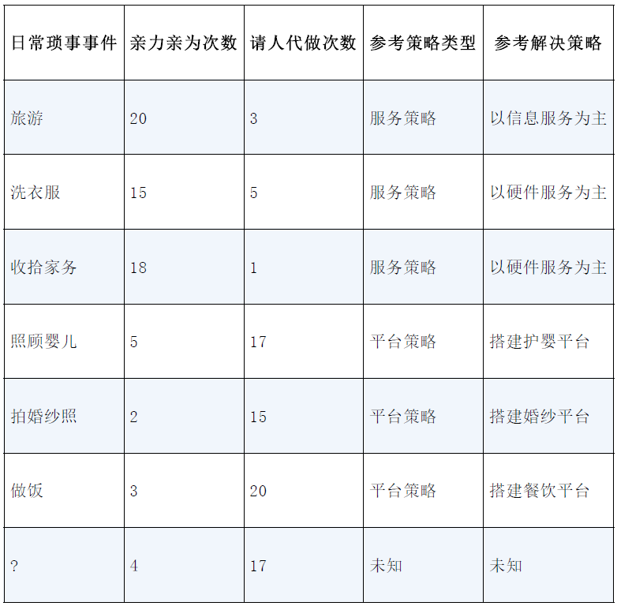
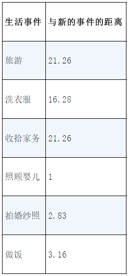
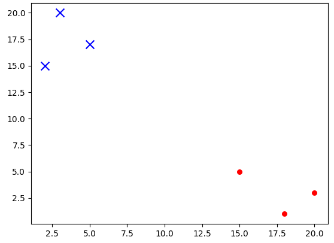
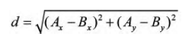
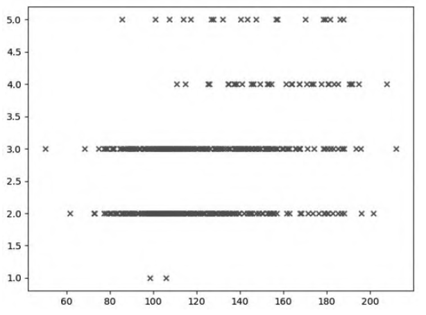
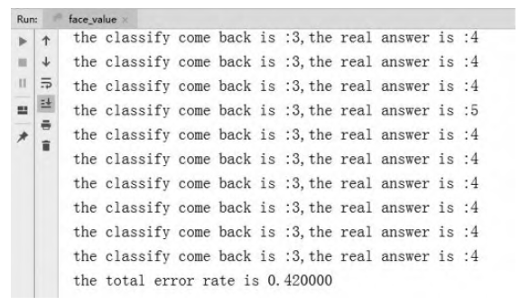
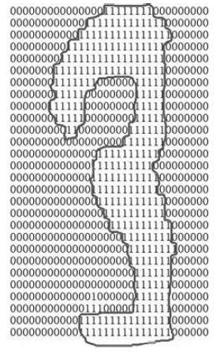

# 算法综述

## 简介

KNN算法是通过**计算不同特征值之间的距离**来进行**分类**的算法。

其工作原理是这样的，存在一个sample data，这个sample data被称作training sample dataset，样本集中每个数据的labels与这些数据之间有着一一对应的关系。

输入没有labels的新数据后，会将新数据的每个features与sample set中数据feature进行比较，然后利用相关的距离算法提取sample set中feature最相似数据的分类标签。

一般会选择sample dataset集中前k个最相似的数据，通常k的取值是不大于20的整数。

最后，选择k个最相似数据中出现次数最多的分类，作为新数据的分类。

### 例子: 日常琐事 - 亲力亲为次数 vs 请人代做次数

*事件亲力亲为和请人代做以及评估*


*生活事件与新的事件的距离计算*


假定 **k=3**，那么3个最靠近的事件依次是
- 照顾婴儿
- 拍婚纱照
- 做饭

KNN算法按照距离最近的3类事件的类型，决定新的事件的具体类型，而这3类事件全是**请人代做**次数比较高的，因此可以判定新的事件可以用**平台策略**。

#### KNN算法的一般流程

1. 收集数据 - 可以使用Pandas模块读文件或者NumPy直接定义feature数据数组
2. 准备数据 - 计算距离所需要的相关数值，结构化的数据格式更能进行需求的处理
3. 分析数据 - 可以使用Pandas或者NumPy模块提供的各种方法，也可以画图以让人一目了然
4. 训练算法 - 这个步骤不适用于KNN算法，KNN相当于不训练
5. 测试算法 - 计算KNN得到结果的错误率
6. 使用算法 - 根据输入sample data和结构化的输出结果，使用KNN算法判定输入数据分别属于哪个分类，最后对计算出的分类执行后续处理

- KNN生活事件dataset创建
```python
import numpy as np
def createDataSet():
    group = np.array( [[20,3],[15,5],[18,1],[5,17],[2,15],[3,20]])
    labels = ["服务策略","服务策略","服务策略","平台策略","平台策略","平台策略"]
    return group, labels

# Testing
print(createDataSet())

# Testing Output:
# (array([[20,  3],
#        [15,  5],
#        [18,  1],
#        [ 5, 17],
#        [ 2, 15],
#        [ 3, 20]]), ['服务策略', '服务策略', '服务策略', '平台策略', '平台策略', '平台策略'])
```

- KNN生活事件dataset的绘制
```python
import matplotlib.pyplot as plt
if __name__=="__main__":
    group, labels = createDataSet()
    x = [item[0] for item in group[:3]]
    y = [item[1] for item in group[:3]]
    plt.scatter(x, y, s=30, c="r", marker="o")
    x = [item[0] for item in group[3:6]]
    y = [item[1] for item in group[3:6]]
    plt.scatter(x, y, s=100, c="b", marker="x")
    plt.show()

# Output:
# 请看下图
```

Output:


#### KNN算法中对未知属性点的操作流程

1. 计算已知类别dataset中的点与当前点之间的距离
2. 按照距离递增排序
3. 选取与当前点距离最小的*k*个点
4. 确定前*k*个点所在类别的出现频率
5. 返回前*k*个点出现频率最高的类别作为当前点的预测分类

- 未知属性点的距离计算分类函数
```python
import operator
def classify(in_x, data, labels, k):
    data_size = data.shape[0] # 6 | data.shape => (6, 2)
    diff_mat = np.tile(in_x, (data_size, 1)) - data
    sqrt_diff = diff_mat ** 2
    sub_distances = sqrt_diff.sum(axis = 1) # [452 265 452   1   8  10]
    distances = sub_distances ** 0.5 # [21.26029163 16.2788206  21.26029163  1.          2.82842712  3.16227766]
    sorted_distances = distances.argsort() # [3 4 5 1 0 2]
    class_count = {}
    for i in range(k):
        votel_label = labels[sorted_distances[i]]
        class_count[votel_label] = class_count.get(votel_label, 0) + 1
    
    sorted_class_count = sorted(class_count.items(), key = operator.itemgetter(1), reverse = True) # [('平台策略', 3)]
    return sorted_class_count[0][0]

# Testing
print(classify([4,17], group, labels, 3))

# Testing Output:
# 平台策略

# Explanation:
# Parameters:
# 1. in_x   : 分类的输入向量
# 2. data   : training set
# 3. labels : 标签
# 4. k      : 最近邻居的数目
# VARIABLE diff_mat
# [[-16  14]
#  [-11  12]
#  [-14  16]
#  [ -1   0]
#  [  2   2]
#  [  1  -3]]
# VARIABLE sqrt_diff
# [[256 196]
#  [121 144]
#  [196 256]
#  [  1   0]
#  [  4   4]
#  [  1   9]]
# =========================================
# 程序使用了欧氏距离公式（Euclidean Distance）
```

距离公式（Euclidean Distance）


### 如何测试分类器

分类器并不会得到百分之百正确的结果。

分类器的性能也会受到多种因素的影响，如分类器设置和数据集等。

KNN算法中，不同的k值，在不同数据集上的表现可能完全不同。

为了测试分类器的效果，可以使用已知答案的数据，检验分类器给出的结果是否是先前已知的答案，当然先前已知答案是不能告诉分类器的。

通过大量的测试数据不断地参与，就可以得到分类器的错误率，这个错误率的计算方式就是用分类器给出错误结果的次数除以测试执行的总数。

### 例子: 对美颜程度打分

下面介绍利用机器学习的KNN算法预测照片美颜程度。

这里用了500张不同程度的美颜照片做训练集，用KNN原理分析和预测，对KNN原理的应用方向是一个很好的扩展。

经过一番总结，把这500张照片的美颜程度的等级分为1~5。

#### KNN算法的一般流程

1. 收集数据 - 提供500张人脸照片和Excel表格文件对500张人脸照片进行美颜等级拟定
2. 准备数据 - 使用Pandas读取Excel文件转换成ndarray，并把人脸图像进行数据化，取中值来对人脸数据进行数值化
3. 分析数据 - 使用Matplotlib画出被分析数据的特征分布图
4. 训练算法 - 这个步骤不适用于KNN算法
5. 测试算法 - 使用网络搜索的方式搜索一部分人脸照片作为测试样本
6. 使用算法 - 可以输入任何一张特征人脸照片，判断此人脸照片最终的美颜程度

#### 准备数据

计算机是不能够直接进行图像识别，只能把图像转化成一个个数据，一般为0和1这种二进制的形式。

把图像转化成数据后，计算机图像的数据就变成了多维数组这种类型，也就是ndarray。

但是KNN算法并不能计算ndarray多维数组的距离。

这里就需要转化，求出这个多维数组中数据的平均值，每幅图像对应的多维数组的平均值也可以说是一个脸部数据的平均值。

在将数据进行KNN算法分类之前，必须将待处理数据的格式改变为分类器可以接受的格式。

即图像文件要转化成ndarray，美颜等级标签要从美颜等级表格中提取出来。

- 美颜等级样本集的读取
```python
import numpy as np
import pandas as pd
from PIL import Image
import os

def createFace():
    faces = pd.read_excel("face.xlsx")
    labels = faces.iloc[:, 1:]
    labels = labels["美颜等级"].values
    files = os.listdir("./pic")
    arrs = []
    for file in files:
        img1 = Image.open("./pic/" + file)
        img_array = np.array(img1)
        arrs.append(round(img_array.mean(), 2))
    arrs = np.array(arrs)
    return arrs, labels

# Explanation:
# 先是利用os模块中的listdir()方法遍历对应文件夹下的所有文件，用for循环去遍历listdir()方法获取的每一个文件
# 利用Pillow模块的Image对象的open()方法去打开每一个遍历得到的图像文件，再用numpy.array()方法把获取的图像文件变成ndarray
# **一定要注意把这个空列表转化成ndarray。
```

#### 分析数据

- 美颜等级样本点的绘制
```python
import matplotlib.pyplot as plt

if __name__=="__main__":
    arrs, labels = createFace()
    x = arrs.tolist()
    y = labels.tolist()
    plt.scatter(x, y, marker="x", s=30)
    plt.show()

# Output:
# 请看下图
```

Output:


#### 测试算法

评估算法的正确率是机器学习算法一个很重要的工作，一般情况下提供已有数据的90%作为训练样本来进行分类器的训练，使用其余10%的数据去完成测试，检测分类器的正确率。

- 美颜等级的打分测试
```python
def faceRatingClassTest():
    arrs, labels = createFace()
    testRate = 0.1
    mlen = arrs.shape[0]
    numEntries = int(testRate * mlen)
    error_count = 0
    for i in range(numEntries):
        classResult = classify(arrs[i], arrs[numEntries:mlen], labels[numEntries:mlen], 3)

    if classResult != labels[i]:
        error_count += 1
        print("the classify come back is :%d,the real answer is:%d"%(classResult, labels[i]))

    print("the total error rate is %f"%(error_count/float(numEntries)))

# Output:
# 请看下图
```

Output:


分类器处理数据集的错误率是42%，这并不是一个好的结果。

可以改变函数faceRatingClassTest()内变量testRate和KNN分类中*k*参数的值。

修改成其他值，可以检测错误率是否随着变量值的变化而变化，分类器的输出结果可能也有很大的不同。

- 美颜等级打分主程序调用
```python
if __name__=="__main__":
    arrs, labels = createFace()
    meanimg = covert_img_to_mean("./pic/501.jpg") # convert_img_to_mean是自己写的函数
    result = classify(meanimg, arrs, labels, 3)
    print(result)
```

### 例子: 手写字识别系统

最简单的手写字识别是识别数字0到9



上图中需要识别的数字是3，而这个3是由1和0组成的二维数组，这个二维数组由1组成的数字边缘构成的就是3。

需要观察的是这个二维数组是由32个行、32个列组成的，图像的尺寸就是32×32。

把32×32转换成1×1024的向量格式，最终需要的识别输出都希望是0~9中的数字。

KNN的原理就把这些转化后1×1024的数组与目标数组进行相减，再对每一行求和并开平方，如果数据的误差不超过k值，就认为这两个手写字是一个字，即完成了预测。

#### KNN手写字识别流程

1. 收集数据 - 提供0~9的training set和testing set的文本文件，文件中都是32 x 32的包含0和1的行列数据。这个文本实际上是由图像转化过来的，这样的转换相当于前一个美颜程度的例子中用NumPy进行的转换，只不过这是由手写的黑白图转化过来的，只有0和1两个数字。
2. 准备数据 - 编写classify()函数实现KNN分类器方法，将读取的文本转换为分类器的list格式。分类器对应的标签输出只有0~9这10个状态
3. 分析数据 - 分析的目标数据中没有空值、异常值的情况，同时对这个数据进行Matplotlib展示也没有必要，这一步可以省略
4. 训练算法 - 这个步骤不适用于KNN算法
5. 测试算法 - 编写函数使用提供的testing set作为测试样本使用，在函数预测过程中，如果预测分类与实际类别不同，则标记为错误，并计算错误率
6. 使用算法 - 输入一个新的图像产生的数字，完成图像的识别，输出最终的识别结果

#### 准备数据: 将图像转换为测试向量

这里，编写一段函数imgToVector()读取行列数据转化成测试向量。

程序先创建1×1024的数组，然后打开每个行列数据的文件，双重循环读出文件的32行、32列的每一行和每一列的值，把读出的值存储在事先定义的数组中，最后返回该数组。

- 手写字识别文件读取
```python
import numpy as np

def imgToVector(file_name):
    vector = np.zeros((1, 1024))
    fr = open(file_name, "r")
    for i in range(32):
        line = fr.readline()
        for j in range(32):
            vector[0, 32*i+j] = int(line[j])
    return vector
```

#### 测试算法

将数据处理成分类器可以识别的ndarray格式，将这些数据输入KNN分类器中，检测KNN分类器的执行效果如何。

listdir()是os模块的方法，可以列出给定目录的文件名

- 手写字识别分类
```python
import numpy as np
import os

def handWritingTest():
    numLabels = []
    trainingFiles = os.listdir("trainingDigits")
    mlen = len(trainingFiles)
    trainingVector = np.ones((mlen, 1024))
    for i in range(mlen):
        fileName = trainingFiles[i]
        fileNameStr = fileName.split(".")[0]
        classNum = int(fileNameStr.split("_")[0])
        numLabels.append(classNum)
    trainingVector[i, :] = imgToVector("trainingDigits/%s"%fileName)
    testFiles = os.listdir("testDigits")
    errorCount = 0.0
    test_len = len(testFiles)
    for i in range(test_len):
        fileName = testFiles[i]
        fileNameStr = fileName.split(".")[0]
        classNum = int(fileNameStr.split("_")[0])
        vectorTest = imgToVector("testDigits/%s"%fileNameStr)
    classify_result = classify(vectorTest, trainingVector, numLabels, 3)
    print("the classifier come back with :%d,the real answer is :%d"%(classify_result,classNum))
    if classify_result != classNum:
        errorCount += 1
    print("the total number of errors is :%d"%errorCount)
    print("the total error rate is :%f")%(errorCount/float(test_len))

# Explanation:
# 1. 首先将traningDigits目录中的文件内容利用os.listdir()方法存储在列表中。
# 2. 然后可以得到目录中的文件总数，将文件总数的值存储在变量mlen中。
# 3. 创建一个mlen行1024列的训练集。
# 4. 该training set的矩阵中每一行就是一幅图像。
# 5. 然后可以从文件名中分离分类数字，这都得益于文件名是按照一定的规则命名的。如文件名8_45.txt表明分类是8，这个文件是数字8的第45实例。
# 6. 把文件名分离得到的分类数字存储到numLabels列表变量中，使用前面准备数据步骤中完成的函数imgToVector()载入每一个图像的数据。
# 7. 对testDigits中的文件执行类似的操作，不同的是不是把测试目录下的文件载入，而是利用classify()方法测试该目录下的每个文件的分类情况。
```

### KNN算法面试题解答

1. KNN算法的距离为什么采用欧氏距离而不用曼哈顿距离?

> 因为曼哈顿距离只计算水平或垂直距离，有维度的限制。而欧氏距离可用于任何空间的距离计算问题。

2. 如果KNN样本分布不平衡，可能给KNN预测结果造成哪些问题，有什么样的解决方式？

> 如果KNN中样本分布存在不平衡，即某一类样本数量远多于其他类别，可能导致KNN在预测时偏向数量大的类别。这意味着即使数量小的类别距离目标样本更近，由于数量大的类别占主导地位，KNN可能更倾向于将目标样本分类为数量大的类别。KNN并不关心样本之间的距离远近，而仅仅考虑样本的数量。

> 为了解决这个问题，可以采用改进方法，即引入权值概念。具体而言，可以赋予距离目标样本较近的邻居更高的权值，而距离较远的邻居则赋予较低的权值。这样一来，KNN在进行预测时不仅仅考虑样本的数量，还考虑了样本之间的距离因素，避免了由于数量大的类别主导而导致的误判情况。这种权值的引入使得KNN更加灵活，更好地适应样本分布不平衡的情况。

## 总结

使用算法时必须保证有接近实际数据的训练样本数据。

缺陷：
1. KNN算法无法给出任何数据的基础结构信息，因此也无法知晓平均实例样本和典型实例样本具有什么特征。
2. 由于必须对数据集中的每个数据计算距离值，实际使用起来也是非常耗时的。
3. KNN算法必须保存全部数据集，如果训练集很大，必须使用大量的存储空间。