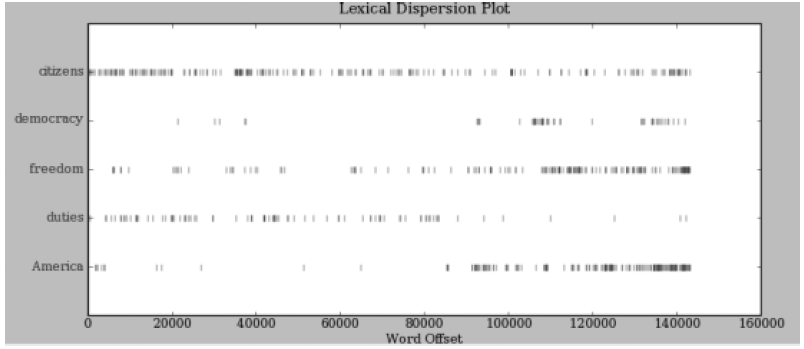

# 第1章 语言处理与 Python

词语索引(concordance)使我们看到词的上下文。例如：我们看到*monstrous*出现的上下文，如*the___ pictures* 和*the ___ size*。

```python
from nltk.book import *
print(text1)
print(text1.concordance("monstrous"))

# Output:
# *** Introductory Examples for the NLTK Book ***
# Loading text1, ..., text9 and sent1, ..., sent9  
# Type the name of the text or sentence to view it.
# Type: 'texts()' or 'sents()' to list the materials.
# text2: Sense and Sensibility by Jane Austen 1811
# text3: The Book of Genesis
# text4: Inaugural Address Corpus
# text5: Chat Corpus
# text6: Monty Python and the Holy Grail
# text7: Wall Street Journal
# text8: Personals Corpus
# text9: The Man Who Was Thursday by G . K . Chesterton 1908
# <Text: Moby Dick by Herman Melville 1851>
# Displaying 11 of 11 matches:
# ong the former , one was of a most monstrous size . ... This came towards us ,
# ON OF THE PSALMS . " Touching that monstrous bulk of the whale or ork we have r
# ll over with a heathenish array of monstrous clubs and spears . Some were thick
# d as you gazed , and wondered what monstrous cannibal and savage could ever hav
# that has survived the flood ; most monstrous and most mountainous ! That Himmal
# they might scout at Moby Dick as a monstrous fable , or still worse and more de
# th of Radney .'" CHAPTER 55 Of the Monstrous Pictures of Whales . I shall ere l
# ing Scenes . In connexion with the monstrous pictures of whales , I am strongly
# ere to enter upon those still more monstrous stories of them which are to be fo
# ght have been rummaged out of this monstrous cabinet there is no telling . But
# of Whale - Bones ; for Whales of a monstrous size are oftentimes cast up dead u
# None
```

还有哪些词出现在相似的上下文中？我们可以通过在被查询的文本名后添加函数名**similar**，然后在括号中插入相关的词来查找到。

```python
print(text1.similar("monstrous"))

# Output:
# true contemptible christian abundant few part mean careful puzzled
# mystifying passing curious loving wise doleful gamesome singular
# delightfully perilous fearless
# None
```

我们从不同的文本中得到的不同结果。Austen(奥斯丁，英国女小说家)使用这些词与Melville 完全不同；在她那里，*monstrous* 是正面的意思，有时它的功能像词*very* 一样作强调成分。

```python
print(text2.similar("monstrous"))

# Output:
# very so exceedingly heartily a as good great extremely remarkably
# sweet vast amazingly
# None
```

函数**common_contexts**允许我们研究两个或两个以上的词共同的上下文，如*monstrous*和*very*。

```python
print(text2.common_contexts(["monstrous", "very"]))

# Output:
# am_glad a_pretty a_lucky is_pretty be_glad
# None
```

- 美国总统就职演说词汇分布图：可以用来研究随时间推移语言使用上的变化
```python
text4.dispersion_plot(["citizens", "democracy", "freedom", "duties", "America"])

# Output: 
# 请看下图
```

Output:


**generate**产生随机文本

请注意，第一次运行此命令时，由于要搜集词序列的统计信息而执行的比较慢。每次运行它，输出的文本都会不同。

```python
text3.generate()

# Output:
# Building ngram index...
# laid by her , and said unto Cain , Where art thou , and said , Go to ,
# I will not do it for ten ' s sons ; we dreamed each man according to
# their generatio the firstborn said unto Laban , Because I said , Nay ,
# but Sarah shall her name be . , duke Elah , duke Shobal , and Akan .
# and looked upon my affliction . Bashemath Ishmael ' s blood , but Isra
# for as a prince hast thou found of all the cattle in the valley , and
# the wo The
```

## 计数词汇

以文本中出现的词和标点符号为单位算出文本从头到尾的长度。

```python
print(len(text3))

# Output:
# 44764

# Explanation:
# 《创世纪》有44764 个词和标点符号或者叫"标识符"。
```

计算所有不同的词汇，重复的词汇只算一次

大写单词排在小写单词前面。

尽管小说中有44,764 个标识符，但只有2,789 个不同的词汇或"词类型"。

一个**词类型**是指一个词在一个文本中独一无二的出现形式或拼写。

我们计数的2,789 个项目中包括标点符号，所以我们把这些叫做唯一项目**类型**而不是词类型。

```python
from nltk.book import *
print(len(set(text3)))

# Output:
# 2789
```

下一个例子向我们展示了每个字平均被使用了16次

```python
print(len(text3) / len(set(text3)))

# Output:
# 16.050197203298673
```

计数一个词在文本中出现的次数

```python
print(text3.count("smote"))

# Output:
# 5
```

词汇频率分布

```python
fdist1 = FreqDist(text1)
print(fdist1)
vocabulary1 = fdist1.keys()
print(vocabulary1)
print(fdist1['whale'])

# Output:
# <FreqDist with 19317 samples and 260819 outcomes>
# dict_keys(['[', 'Moby', 'Dick', 'by', 'Herman', 'Melville', '1851', ']', 'ETYMOLOGY'...])
# 906
```

只出现了一次的词 - hapaxes - 低频词

```python
fdist1 = FreqDist(text1)
print(fdist1.hapaxes())

# Output:
# ['Herman', 'Melville', ']', 'ETYMOLOGY', 'Late', 'Consumptive', 'School', 'threadbare', 'lexicons', 'mockingly', 'flags', 'mortality', 'signification', 'HACKLUYT'.....]
```

## 细粒度的选择词

## 词语搭配和双连词（bigrams）

一个搭配是异乎寻常的经常在一起出现的词序列。

*red wine* 是一个搭配而*the wine* 不是。

一个搭配的特点是其中的词不能被类似的词置换。例如：*maroon wine*（粟色酒）听起来就很奇怪。

要获取搭配，我们先从提取文本词汇中的词对也就是双连词开始。

搭配基本上就是频繁的双连词。

特别的，我们希望找到比我们基于单个词的频率预期得到的更频繁出现的双连词。

```python
print(text4.collocations())

# Output:
# United States; fellow citizens; years ago; four years; Federal
# Government; General Government; American people; Vice President; God
# bless; Chief Justice; one another; fellow Americans; Old World;
# Almighty God; Fellow citizens; Chief Magistrate; every citizen; Indian
# tribes; public debt; foreign nations
# None
```

## 计数其他东西


FreqDist 计数链表中每个数字出现的次数

```python
fdist = FreqDist([len(w) for w in text1])
print(fdist)
print(fdist.items())

# Output:
# <FreqDist with 19 samples and 260819 outcomes>
# dict_items([(1, 47933), (4, 42345), (2, 38513), (6, 17111), (8, 9966), (9, 6428), (11, 1873), (5, 26597), (7, 14399), (3, 50223), (10, 3528), (12, 1053), (13, 567), (14, 177), (16, 22), (15, 70), (17, 12), (18, 1), (20, 1)])
```